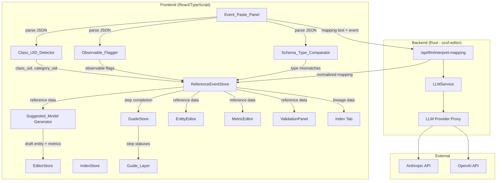
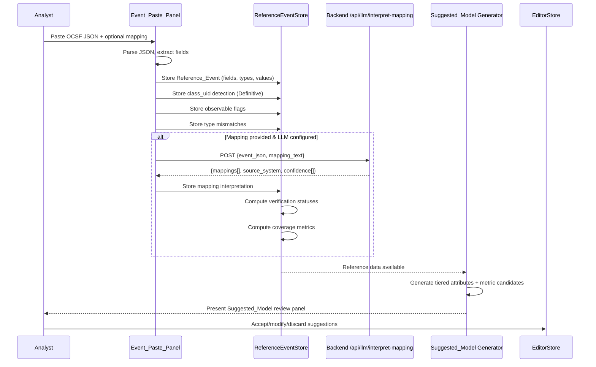

# Design Document: Analyst Data-First Workflow

## Overview

This design transforms the OCSF Semantic Model Editor from a schema-first to a data-first workflow. The analyst pastes a transformed OCSF JSON event (and optionally a mapping artifact in any format) as step 1. The system extracts `class_uid` for definitive event class detection, flags observables, infers field types, and seeds the entire downstream modeling pipeline — entity creation, metric suggestions, and validation — from actual data.

The guided wizard is restructured from 6 steps to 4: (1) Paste Event + Optional Mapping, (2) Define Entity & Map Attributes, (3) Add Metrics, (4) Validate Model. The Index tab becomes optional advanced functionality. When a mapping artifact is provided, it is sent to the configured LLM (Anthropic/OpenAI) via the existing Rust backend proxy for structured interpretation, enabling auto-populated field lineage with confidence scoring and verification against the reference event.

The existing manual schema-browsing flow is preserved as a seamless fallback — the UI is unified, not branched.

### Key Design Decisions

1. **Client-side parsing, server-side LLM**: JSON parsing, `class_uid` detection, observable flagging, and type comparison all happen client-side in TypeScript. Only the LLM mapping interpretation requires a backend call, following the existing research feature pattern through `ocsf-editor`.

2. **New Zustand store (ReferenceEventStore)**: A dedicated store holds the parsed event, detected metadata, observable flags, mapping interpretation results, verification statuses, and coverage metrics. Other stores (EditorStore, GuideStore) read from it but don't own this data.

3. **Guide system evolution, not replacement**: The existing `GuideStep`, `StepStatus`, and overlay components are extended with new step definitions and prerequisite chains. The 4-step IDs replace the 6-step IDs.

4. **Tiered suggested model**: The auto-generated entity organizes attributes into Core/Extended/Potential tiers based on schema presence, event observation, and mapping support — giving analysts a structured starting point they can accept, modify, or discard.

5. **LLM mapping is format-agnostic**: The prompt instructs the LLM to interpret any mapping format. The backend receives raw text + reference event JSON and returns a normalized structure. No format-specific parsers are needed.

## Architecture



### Data Flow



## Components and Interfaces

### 1. Event_Paste_Panel (Extended LogImport)

Extends the existing `LogImport` component to serve as the primary entry point on the Schema tab.

```typescript
// editor-ui/src/components/EventPastePanel/EventPastePanel.tsx

interface EventPastePanelProps {
  onEventParsed: (event: ReferenceEvent) => void;
  onMappingInterpreted: (mapping: InterpretedMapping) => void;
  onClear: () => void;
}

// Internal state managed via ReferenceEventStore
// - Primary textarea: OCSF JSON paste
// - File upload button: .json files
// - Secondary collapsible textarea: Mapping artifact (any format)
// - "Skip — browse schema manually" link
// - Summary panel: field count, class detection, observable count, mapping summary
// - "Working from a single sample event" banner
```

### 2. Class_UID_Detector

Pure function module — no component, just logic.

```typescript
// editor-ui/src/utils/classUidDetector.ts

interface ClassDetectionResult {
  classUid: number | null;
  categoryUid: number | null;
  className: string | null;
  categoryName: string | null;
  confidence: 'Definitive' | 'Low';
  error: string | null;  // e.g., "class_uid 99999 not found in schema"
}

function detectClassUid(
  parsedEvent: Record<string, unknown>,
  schemaTree: SchemaTree
): ClassDetectionResult;
```

### 3. Observable_Flagger

Pure function module for identifying observable fields.

```typescript
// editor-ui/src/utils/observableFlagger.ts

type ObservableType = 'ip' | 'hostname' | 'hash' | 'url' | 'email' | 'mac' | 'process';

interface ObservableFlag {
  fieldPath: string;
  observableType: ObservableType;
  confidence: 'High' | 'Medium';  // High = name + value match, Medium = value only
  matchedBy: 'name' | 'value' | 'both';
}

function flagObservables(
  fields: ParsedField[]
): ObservableFlag[];
```

### 4. Schema_Type_Comparator

Pure function module for comparing observed vs schema types.

```typescript
// editor-ui/src/utils/schemaTypeComparator.ts

interface TypeMismatch {
  fieldPath: string;
  observedType: string;
  schemaType: string;
}

function compareTypes(
  fields: ParsedField[],
  classUid: number,
  schemaTree: SchemaTree
): TypeMismatch[];
```

### 5. Suggested_Model Generator

Produces a draft entity with tiered attributes and metric candidates.

```typescript
// editor-ui/src/utils/suggestedModelGenerator.ts

type AttributeTier = 'core' | 'extended' | 'potential';

interface SuggestedAttribute {
  name: string;
  fieldPath: string;
  type: string;
  sampleValue: string;
  tier: AttributeTier;
  isObservable: boolean;
  lineage?: { rawField: string; transformation: string };
}

interface SuggestedMetric {
  name: string;
  description: string;       // plain-language, e.g., "Unique source IPs per hour"
  aggregation: string;        // count, sum, avg, count_distinct, ratio, rate, top_n
  fieldMeasure: string;
  dimensions: string[];
  timeGranularities: string[];
  confidence: 'High' | 'Medium' | 'Low';
}

interface SuggestedModel {
  entityName: string;
  classUid: number;
  attributes: SuggestedAttribute[];
  metrics: SuggestedMetric[];
}

function generateSuggestedModel(
  referenceEvent: ReferenceEvent,
  schemaTree: SchemaTree,
  mapping: InterpretedMapping | null
): SuggestedModel;
```

### 6. ReferenceEventStore (New Zustand Store)

```typescript
// editor-ui/src/store/referenceEventStore.ts

interface ReferenceEventState {
  // Core event data
  rawJson: string | null;
  parsedFields: ParsedField[];
  classDetection: ClassDetectionResult | null;
  observableFlags: ObservableFlag[];
  typeMismatches: TypeMismatch[];
  
  // LLM mapping interpretation
  mappingRawText: string | null;
  interpretedMapping: InterpretedMapping | null;
  mappingLoading: boolean;
  mappingError: string | null;
  
  // Verification & coverage (computed from event + mapping)
  verificationStatuses: Map<string, VerificationStatus>;
  mappingCoverage: MappingCoverage | null;
  
  // Actions
  setReferenceEvent: (json: string) => void;
  clearReferenceEvent: () => void;
  setInterpretedMapping: (mapping: InterpretedMapping) => void;
  clearMapping: () => void;
  setMappingLoading: (loading: boolean) => void;
  setMappingError: (error: string | null) => void;
  computeVerification: () => void;
  computeCoverage: () => void;
}
```

### 7. Backend API: Mapping Interpretation Endpoint

New endpoint in `ocsf-editor` following the existing research pattern.

```rust
// ocsf-editor/src/api/mapping.rs

/// POST /api/llm/interpret-mapping
/// 
/// Request body:
/// {
///   "event_json": "{ ... raw OCSF event ... }",
///   "mapping_text": "... any format mapping artifact ..."
/// }
///
/// Response body:
/// {
///   "mappings": [
///     {
///       "raw_field": "src_ip",
///       "ocsf_field": "src_endpoint.ip",
///       "transformation": "direct copy",
///       "confidence": "High",
///       "explanation": "Explicit field mapping in Logstash filter"
///     }
///   ],
///   "source_system": {
///     "log_type": "firewall",
///     "vendor": "Palo Alto"
///   },
///   "issues": ["Field 'custom_field' has no OCSF equivalent"]
/// }

#[derive(Debug, Serialize, Deserialize)]
pub struct InterpretMappingRequest {
    pub event_json: String,
    pub mapping_text: String,
}

#[derive(Debug, Serialize, Deserialize)]
pub struct MappingEntry {
    pub raw_field: String,
    pub ocsf_field: String,
    pub transformation: Option<String>,
    pub confidence: MappingConfidence,
    pub explanation: Option<String>,
}

#[derive(Debug, Serialize, Deserialize)]
#[serde(rename_all = "snake_case")]
pub enum MappingConfidence {
    High,
    Medium,
    Low,
}

#[derive(Debug, Serialize, Deserialize)]
pub struct SourceSystem {
    pub log_type: Option<String>,
    pub vendor: Option<String>,
}

#[derive(Debug, Serialize, Deserialize)]
pub struct InterpretMappingResponse {
    pub mappings: Vec<MappingEntry>,
    pub source_system: SourceSystem,
    pub issues: Vec<String>,
}
```

### 8. Guide System Updates

The existing guide types and store are updated for the 4-step workflow.

```typescript
// Updated guide types (editor-ui/src/types/guide.ts)

// GuideStepId changes from 1|2|3|4|5|6 to 1|2|3|4
export type GuideStepId = 1 | 2 | 3 | 4;

export const GUIDE_STEPS: Omit<GuideStep, 'status'>[] = [
  { id: 1, label: 'Paste Event (+ Optional Mapping)', targetTab: 'schema',
    description: 'Paste a transformed OCSF event to auto-detect the event class and seed the workflow. Optionally include a mapping artifact for field lineage.' },
  { id: 2, label: 'Define Entity & Map Attributes', targetTab: 'entities',
    description: 'Create a semantic entity from your event data. Accept, modify, or discard the suggested model.' },
  { id: 3, label: 'Add Metrics', targetTab: 'metrics',
    description: 'Define aggregation metrics. Review suggested metrics derived from your event fields.' },
  { id: 4, label: 'Validate Model', targetTab: 'validation',
    description: 'Validate your semantic model against the OCSF schema and your sample event data.' },
];

export const STEP_TO_TAB: Record<GuideStepId, TabId> = {
  1: 'schema',
  2: 'entities',
  3: 'metrics',
  4: 'validation',
};

export const STEP_PREREQUISITES: Record<GuideStepId, GuideStepId[]> = {
  1: [],
  2: [1],       // Step 1 OR manual class selection
  3: [2],
  4: [2, 3],
};
```


## Data Models

### ParsedField

Represents a single extracted field from the pasted OCSF JSON event.

```typescript
interface ParsedField {
  path: string;          // dot-notation, e.g., "src_endpoint.ip"
  type: string;          // inferred: "string" | "integer" | "float" | "boolean" | "array" | "object" | "null"
  value: string;         // stringified sample value
  rawValue: unknown;     // original JS value for type checking
}
```

### ReferenceEvent

The complete parsed event stored in ReferenceEventStore.

```typescript
interface ReferenceEvent {
  rawJson: string;
  fields: ParsedField[];
  classUid: number | null;
  categoryUid: number | null;
  className: string | null;
  categoryName: string | null;
  classConfidence: 'Definitive' | 'Low';
  observables: ObservableFlag[];
  typeMismatches: TypeMismatch[];
  parsedAt: string;  // ISO timestamp
}
```

### InterpretedMapping

Normalized result from the LLM mapping interpretation.

```typescript
interface InterpretedMapping {
  entries: MappingEntry[];
  sourceSystem: {
    logType: string | null;
    vendor: string | null;
  };
  issues: string[];
  interpretedAt: string;  // ISO timestamp
}

interface MappingEntry {
  rawField: string;
  ocsfField: string;
  transformation: string | null;
  confidence: 'High' | 'Medium' | 'Low';
  explanation: string | null;
  verificationStatus: 'Verified' | 'Unverified' | 'Conflict';
  conflictDetail: string | null;  // e.g., "Mapping declares integer, event shows string"
}
```

### VerificationStatus

Computed by cross-referencing mapping entries against reference event fields.

```typescript
type VerificationStatus = 'Verified' | 'Unverified' | 'Conflict';

// Verification logic:
// - "Verified": mapping.ocsfField exists in referenceEvent.fields
// - "Unverified": mapping.ocsfField not found in referenceEvent.fields
// - "Conflict": mapping.ocsfField exists but type contradicts mapping declaration
```

### MappingCoverage

Computed metrics showing mapping completeness.

```typescript
interface MappingCoverage {
  percentEventFieldsMapped: number;       // % of event fields with a mapping entry
  percentMappingFieldsUnobserved: number; // % of mapping entries referencing absent event fields
  percentEventFieldsUnmapped: number;     // % of event fields with no mapping entry
  unmappedFieldPaths: string[];           // specific event fields without mappings
  unobservedMappingFields: string[];      // specific mapping ocsf_fields not in event
}
```

### Rust Backend Types

```rust
// ocsf-editor/src/api/mapping.rs

/// Request to interpret a mapping artifact via LLM.
#[derive(Debug, Serialize, Deserialize)]
pub struct InterpretMappingRequest {
    pub event_json: String,
    pub mapping_text: String,
}

/// A single field-to-field mapping entry extracted by the LLM.
#[derive(Debug, Clone, Serialize, Deserialize)]
pub struct MappingEntry {
    pub raw_field: String,
    pub ocsf_field: String,
    #[serde(skip_serializing_if = "Option::is_none")]
    pub transformation: Option<String>,
    pub confidence: MappingConfidence,
    #[serde(skip_serializing_if = "Option::is_none")]
    pub explanation: Option<String>,
}

/// Confidence level for an LLM-extracted mapping entry.
#[derive(Debug, Clone, Serialize, Deserialize, PartialEq)]
#[serde(rename_all = "lowercase")]
pub enum MappingConfidence {
    High,
    Medium,
    Low,
}

/// Source system metadata extracted by the LLM.
#[derive(Debug, Clone, Serialize, Deserialize)]
pub struct SourceSystem {
    #[serde(skip_serializing_if = "Option::is_none")]
    pub log_type: Option<String>,
    #[serde(skip_serializing_if = "Option::is_none")]
    pub vendor: Option<String>,
}

/// Response from the mapping interpretation endpoint.
#[derive(Debug, Serialize, Deserialize)]
pub struct InterpretMappingResponse {
    pub mappings: Vec<MappingEntry>,
    pub source_system: SourceSystem,
    pub issues: Vec<String>,
}
```

### Guide Step Derivation Logic

```typescript
// editor-ui/src/store/guideLogic.ts (updated)

function deriveStepStatuses(
  model: SemanticModel,
  referenceEvent: ReferenceEvent | null,
  lastValidationRun: string | null,
  activeTab: TabId
): Record<GuideStepId, StepStatus> {
  // Step 1: Complete if referenceEvent loaded with class detected, OR manual class selected
  // Step 2: Complete if at least one entity defined with attributes
  // Step 3: Complete if at least one metric defined
  // Step 4: Complete if validation has been run
}
```

### localStorage Persistence

The ReferenceEventStore persists to `localStorage` under key `ocsf-reference-event`:

```typescript
interface ReferenceEventSaveState {
  version: 1;
  rawJson: string;
  mappingRawText: string | null;
  interpretedMapping: InterpretedMapping | null;
  parsedAt: string;
}
```

On load, the store re-parses the raw JSON to regenerate derived state (fields, observables, type mismatches, verification, coverage) rather than persisting computed data. This ensures consistency if detection logic is updated. If the stored data is corrupted or incompatible, the store falls back to empty state with a `console.warn`.


## Correctness Properties

*A property is a characteristic or behavior that should hold true across all valid executions of a system — essentially, a formal statement about what the system should do. Properties serve as the bridge between human-readable specifications and machine-verifiable correctness guarantees.*

### Property 1: JSON field extraction preserves structure

*For any* valid JSON object, parsing it through the event field extractor should produce a list of `ParsedField` entries where every leaf value in the original JSON has a corresponding entry with the correct dot-notation path, inferred type, and sample value.

**Validates: Requirements 1.2**

### Property 2: File upload and paste equivalence

*For any* valid JSON string, processing it via file upload should produce the identical `ParsedField[]` result as processing it via direct paste.

**Validates: Requirements 1.3**

### Property 3: Invalid JSON rejection

*For any* string that is not valid JSON, the parser should return an error result (not throw), and the original input string should be preserved in the UI state.

**Validates: Requirements 1.4**

### Property 4: Clear resets all derived state

*For any* loaded ReferenceEventStore state (with or without mapping), calling `clearReferenceEvent` should result in all fields being null/empty: `rawJson`, `parsedFields`, `classDetection`, `observableFlags`, `typeMismatches`, `interpretedMapping`, `verificationStatuses`, and `mappingCoverage`.

**Validates: Requirements 1.7, 7.3**

### Property 5: class_uid resolution correctness

*For any* valid `class_uid` integer that exists in the schema tree, the `Class_UID_Detector` should resolve it to the exact event class name defined in the schema for that UID.

**Validates: Requirements 2.1**

### Property 6: category_uid resolution correctness

*For any* valid `category_uid` integer that exists in the schema tree, the `Class_UID_Detector` should resolve it to the exact category name defined in the schema for that UID.

**Validates: Requirements 2.2**

### Property 7: Detection confidence invariant

*For any* parsed JSON object, if `class_uid` is present and resolves to a valid class, the confidence should be `Definitive`. If `class_uid` is absent, the confidence should be `Low`.

**Validates: Requirements 2.3, 2.5**

### Property 8: Unrecognized class_uid produces null with warning

*For any* `class_uid` integer value that does not exist in the schema tree, the `Class_UID_Detector` should return `className: null` and a non-empty error string containing the unrecognized value.

**Validates: Requirements 2.6**

### Property 9: Observable detection correctness

*For any* set of parsed fields, the `Observable_Flagger` should flag a field as observable if and only if the field path matches an observable name heuristic (contains "ip", "host", "hash", "url", "email", "mac") OR the field value matches an observable value pattern (IPv4/IPv6 regex, hostname pattern, hash length pattern, URL pattern, email pattern, MAC pattern). Each flagged field should have a valid `ObservableType` classification.

**Validates: Requirements 3.1, 3.2, 3.3**

### Property 10: Observable confidence levels

*For any* field flagged as observable, if both the field name heuristic and value pattern matched, the confidence should be `High`. If only the value pattern matched (no name match), the confidence should be `Medium`.

**Validates: Requirements 3.4, 3.5**

### Property 11: Type comparison detects mismatches

*For any* set of parsed fields and a valid event class in the schema, the `Schema_Type_Comparator` should flag a mismatch for every field where the inferred type differs from the schema-defined type, and each mismatch should contain both the observed type and the schema type.

**Validates: Requirements 4.1, 4.2**

### Property 12: Step 1 completion derivation

*For any* guide derivation state, Step 1 should be marked `complete` if and only if a Reference_Event is loaded with a detected class_uid, OR a class has been manually selected in the EditorStore (even without a Reference_Event).

**Validates: Requirements 5.4, 5.5**

### Property 13: No core step depends on Index tab

*For any* step in the 4-step prerequisite chain, the prerequisites should never include a step that maps to the Index tab.

**Validates: Requirements 6.3**

### Property 14: localStorage round-trip for Reference_Event

*For any* valid Reference_Event stored in the ReferenceEventStore, persisting to localStorage and then restoring should produce a state where re-parsing the stored `rawJson` yields the same `parsedFields`, `classDetection`, `observableFlags`, and `typeMismatches`.

**Validates: Requirements 7.4**

### Property 15: Corrupted localStorage fallback

*For any* corrupted or incompatible string stored under the Reference_Event localStorage key, the ReferenceEventStore should initialize to empty state (all fields null/empty) without throwing.

**Validates: Requirements 7.5**

### Property 16: Suggested model tier classification

*For any* Reference_Event with a detected event class and the corresponding schema, the `Suggested_Model` generator should classify each attribute into exactly one tier: `Core` for attributes present in the event AND required/recommended in the schema, `Extended` for attributes present in the event but optional in the schema, `Potential` for attributes defined in the schema but absent from the event. Every attribute should belong to exactly one tier.

**Validates: Requirements 9.1, 9.5**

### Property 17: Numeric fields produce aggregation metric suggestions

*For any* Reference_Event containing at least one numeric field (integer or float), the metric suggestion generator should produce at least one metric suggestion with aggregation type `count`, `sum`, or `avg` referencing that field.

**Validates: Requirements 10.2**

### Property 18: Timestamp fields produce time-based metric suggestions

*For any* Reference_Event containing at least one timestamp field, the metric suggestion generator should produce at least one metric suggestion with time-granularity options AND at least one event-rate metric suggestion.

**Validates: Requirements 10.3, 10.6**

### Property 19: Observable string fields produce cardinality metrics

*For any* Reference_Event containing at least one string field flagged as observable, the metric suggestion generator should produce at least one `count_distinct` metric suggestion for that field.

**Validates: Requirements 10.4**

### Property 20: Suggested metrics have plain-language descriptions

*For any* suggested metric (including derived metrics like cardinality, ratio, rate, top-N), the `description` field should be non-empty and should not be identical to the metric name or the raw aggregation expression.

**Validates: Requirements 10.8**

### Property 21: Validation cross-references model against Reference_Event

*For any* semantic model and Reference_Event, validation should produce a warning for every entity attribute that references a field path not present in the Reference_Event's parsed fields.

**Validates: Requirements 11.1, 11.2**

### Property 22: Non-numeric metric field validation error

*For any* semantic model metric whose `field_measure` references a field that exists in the Reference_Event but has a non-numeric type, validation should produce an error identifying the field and its observed type.

**Validates: Requirements 11.3**

### Property 23: Schema-only validation without Reference_Event

*For any* semantic model validated without a Reference_Event, the validation result should contain zero sample-event-based warnings or errors — only schema-based results.

**Validates: Requirements 11.4**

### Property 24: Dry-run metric simulation

*For any* semantic metric and Reference_Event, the dry-run should produce either a computed numeric value (when the referenced field exists and is numeric in the event) or a null/missing result with a non-empty reason string (when the field is absent or non-numeric).

**Validates: Requirements 11.6, 11.7**

### Property 25: Nested JSON flattened to dot-notation

*For any* JSON object containing nested objects, the field extractor should produce paths using dot-notation (e.g., `src_endpoint.ip`) and should never produce a `ParsedField` with type `object` as a leaf — nested objects should be recursively flattened.

**Validates: Requirements 14.6**

### Property 26: Non-integer class_uid fallback

*For any* parsed JSON where `class_uid` is present but is not a valid integer (e.g., string, float, null, boolean), the `Class_UID_Detector` should return `className: null` with a non-empty error message and not throw.

**Validates: Requirements 14.2**

### Property 27: Robustness — no unhandled exceptions

*For any* string input (including empty string, whitespace, binary data, extremely long strings, and deeply nested JSON), the event parsing pipeline should never throw an unhandled exception — it should always return either a successful parse result or a structured error.

**Validates: Requirements 14.5**

### Property 28: Valid JSON without OCSF fields warns but proceeds

*For any* valid JSON object that contains no recognizable OCSF fields (no `class_uid`, `category_uid`, `activity_id`, `type_uid`, or `metadata` fields), the parser should still extract fields successfully AND produce a warning message, but should not block the workflow.

**Validates: Requirements 14.1**

### Property 29: Verification status correctness

*For any* mapping entry and Reference_Event, the verification status should be: `Verified` if the `ocsf_field` matches a field path in the Reference_Event, `Unverified` if the `ocsf_field` does not match any field path, `Conflict` if the `ocsf_field` matches a field path but the mapping's declared type contradicts the observed type. Every mapping entry should have exactly one verification status.

**Validates: Requirements 16.1, 16.2, 16.3, 16.4**

### Property 30: Mapping coverage metrics correctness

*For any* Reference_Event with N fields and an InterpretedMapping with M entries, the coverage metrics should satisfy: `percent_event_fields_mapped + percent_event_fields_unmapped = 100`, `unmappedFieldPaths.length` equals the count of event fields with no mapping entry, and `unobservedMappingFields.length` equals the count of mapping entries whose `ocsf_field` is not in the event fields.

**Validates: Requirements 17.1, 17.4, 17.5**

### Property 31: Clearing mapping preserves Reference_Event

*For any* state where both a Reference_Event and InterpretedMapping are loaded, calling `clearMapping` should remove the mapping, verification statuses, and coverage metrics, while preserving the Reference_Event, class detection, observable flags, and type mismatches unchanged.

**Validates: Requirements 15.10**

### Property 32: Mapping without event defers LLM call

*For any* state where mapping text is provided but no Reference_Event is loaded, the system should not initiate an LLM call. The mapping text should be stored but interpretation should be deferred until a Reference_Event becomes available.

**Validates: Requirements 15.11**

### Property 33: LLM response normalization

*For any* valid LLM response JSON containing a `mappings` array, `source_system` object, and `issues` array, the parser should produce an `InterpretedMapping` where every entry has a non-empty `rawField`, a non-empty `ocsfField`, and a valid `confidence` value (High, Medium, or Low).

**Validates: Requirements 15.2**

### Property 34: Filter mapping entries by status

*For any* set of mapping entries and a filter criterion (confidence level or verification status), filtering should return exactly the entries matching that criterion, and sorting by confidence should order High > Medium > Low.

**Validates: Requirements 15.14, 16.6**

## Error Handling

### Client-Side Errors

| Error Scenario | Handling Strategy | User Experience |
|---|---|---|
| Invalid JSON paste | Catch `JSON.parse` error, display descriptive message, retain input | Red error banner below textarea with parse error details |
| Missing `class_uid` | Set class to null, confidence to Low | Yellow warning with instruction to select class manually |
| Unrecognized `class_uid` | Set class to null, show warning with the value | Yellow warning: "class_uid 99999 not found in loaded schema" |
| Non-integer `class_uid` | Set class to null, show error | Red error: "class_uid must be an integer, got: <type>" |
| Schema tree not loaded | Queue detection, execute when schema available | Spinner with "Waiting for schema..." |
| localStorage write failure | Operate in-memory, log `console.warn` | No visible impact — data persists only for session |
| localStorage read corruption | Fall back to empty state, log `console.warn` | Clean start — no stale data |
| Deeply nested JSON (>20 levels) | Flatten with depth limit, warn about truncation | Warning: "Nested fields beyond depth 20 were truncated" |

### Backend/LLM Errors

| Error Scenario | Handling Strategy | User Experience |
|---|---|---|
| No LLM configured | Disable mapping textarea, show config message | Grayed textarea: "Configure LLM in Settings to enable" |
| LLM network error | Display error, preserve mapping text, offer retry | Error banner with "Retry" button |
| LLM rate limit | Display error with backoff suggestion | "Rate limited — try again in a few seconds" |
| LLM auth error | Display error, suggest checking API key | "Authentication failed — check your API key in Settings" |
| LLM timeout | Display timeout error, offer retry | "Request timed out — Retry" |
| LLM returns invalid JSON | Parse error, display generic failure, offer retry | "Failed to parse LLM response — Retry" |
| LLM returns empty mappings | Accept result, show "No mappings found" | Info banner: "LLM found no field mappings in the artifact" |

### Error Propagation Rules

1. **Event parsing errors never block the UI** — the Tab_UI always renders, even if parsing fails.
2. **LLM errors never affect the Reference_Event** — a failed mapping interpretation leaves the parsed event intact.
3. **Validation errors are warnings, not blockers** — the analyst can proceed even with mismatches.
4. **All errors are recoverable** — retry buttons for LLM, re-paste for JSON, manual fallback for detection.

## Testing Strategy

### Property-Based Testing (proptest)

Property-based tests validate the correctness properties defined above. Each test runs a minimum of 100 iterations with random inputs.

**Rust-side (ocsf-editor crate):**

- `MappingConfidence` and `SourceSystem` serde round-trip (Property 33)
- `InterpretMappingResponse` serialization/deserialization round-trip
- LLM response JSON parsing robustness

**TypeScript-side (editor-ui, using fast-check):**

- JSON field extraction (Property 1, 25)
- Class_UID_Detector correctness (Properties 5, 6, 7, 8, 26)
- Observable_Flagger detection and confidence (Properties 9, 10)
- Schema_Type_Comparator mismatch detection (Property 11)
- Verification status computation (Property 29)
- Coverage metrics computation (Property 30)
- Suggested model tier classification (Property 16)
- Metric suggestion generation (Properties 17, 18, 19, 20)
- State reset/clear operations (Properties 4, 31)
- Guide step derivation (Properties 12, 13)
- localStorage round-trip (Property 14)
- Robustness/no-throw (Properties 3, 15, 27, 28)
- Filter/sort operations (Property 34)

**PBT Library:** `fast-check` for TypeScript, `proptest` for Rust.

**Tag format:** Each test tagged with: `Feature: analyst-data-first-workflow, Property {N}: {title}`

**Configuration:** Minimum 100 iterations per property test. Each correctness property implemented by a single property-based test.

### Unit Testing

Unit tests complement property tests for specific examples, edge cases, and integration points:

- **Edge cases:** Empty JSON `{}`, JSON with only `class_uid`, JSON with 100+ nested levels, extremely long field values, Unicode field names
- **Integration:** ReferenceEventStore ↔ EditorStore synchronization, Guide step derivation with various store states
- **LLM integration:** Mock LLM responses for mapping interpretation endpoint, error response handling
- **UI components:** EventPastePanel rendering states (empty, loaded, error, loading), SuggestedModel review panel accept/discard flows
- **Dry-run simulation:** Specific metric types against known event data

### Test Organization

```
editor-ui/
  src/
    utils/__tests__/
      classUidDetector.test.ts
      classUidDetector.property.test.ts
      observableFlagger.test.ts
      observableFlagger.property.test.ts
      schemaTypeComparator.test.ts
      schemaTypeComparator.property.test.ts
      suggestedModelGenerator.test.ts
      suggestedModelGenerator.property.test.ts
      eventFieldExtractor.test.ts
      eventFieldExtractor.property.test.ts
      verificationComputer.test.ts
      verificationComputer.property.test.ts
      coverageComputer.test.ts
      coverageComputer.property.test.ts
    store/__tests__/
      referenceEventStore.test.ts
      referenceEventStore.property.test.ts
      guideLogic.test.ts
      guideLogic.property.test.ts

ocsf-editor/
  src/
    api/mapping.rs          (includes unit tests)
    api/mapping_proptest.rs (property tests for serde round-trips)
```
