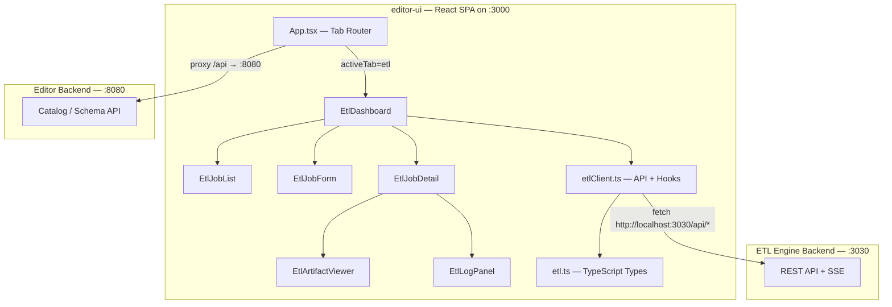
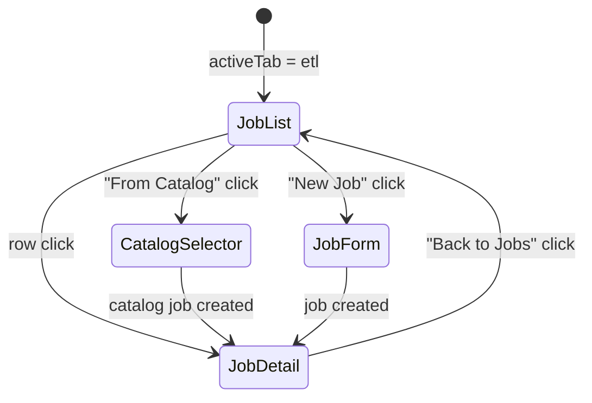
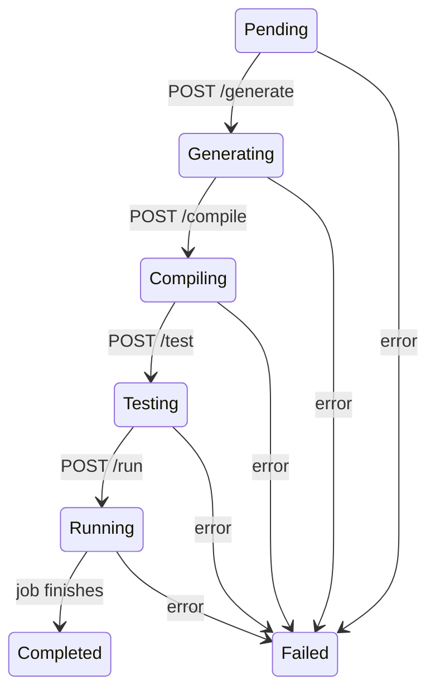

# Design Document: ETL Engine GUI

## Overview

The ETL Engine GUI adds an "ETL" tab to the existing OCSF Semantic Model Editor (editor-ui) React application. It provides a visual dashboard for managing ETL jobs that transform raw security log data into OCSF-normalized Delta Lake tables. The GUI communicates with a separate ETL Engine backend (Rust/Axum on port 3030) via a dedicated API client, distinct from the editor backend proxy on port 8080.

The design follows the existing editor-ui conventions: React 18 + TypeScript + Vite, TanStack React Query v5 for data fetching, Zustand v5 for local UI state, plain CSS files, and the established component folder structure (ComponentName/ComponentName.tsx + .css + index.ts).

Key user flows:
1. View all ETL jobs with live status polling
2. Create a new job (manual form or from catalog entry)
3. Advance a job through the Generate → Compile → Test → Run lifecycle
4. Preview generated artifacts (Go, SQL, YAML) with Monaco Editor syntax highlighting
5. Stream real-time logs via SSE

## Architecture



The ETL API client uses a direct base URL (`http://localhost:3030`) rather than the Vite proxy, since the ETL Engine is a separate server. All other editor-ui API calls continue through the existing `/api` proxy to port 8080.

### Navigation Model

The existing app uses state-based navigation (no react-router). The ETL tab follows the same pattern:



ETL sub-navigation is managed by a `etlView` state variable in `EtlDashboard` with values: `'list' | 'form' | 'detail'`.

### Job Lifecycle State Machine



Each lifecycle transition is triggered by a single POST to the corresponding endpoint. The UI polls job status every 3 seconds and enables only the action button valid for the current state.

## Components and Interfaces

### File Structure

```
editor-ui/src/
├── api/
│   └── etlClient.ts          # ETL fetch functions + React Query hooks
├── types/
│   └── etl.ts                 # TypeScript types mirroring Rust EtlJob
├── components/
│   ├── EtlDashboard/
│   │   ├── EtlDashboard.tsx   # Top-level ETL tab container + sub-nav state
│   │   ├── EtlDashboard.css
│   │   └── index.ts
│   ├── EtlJobList/
│   │   ├── EtlJobList.tsx     # Job table with polling + status badges
│   │   ├── EtlJobList.css
│   │   └── index.ts
│   ├── EtlJobForm/
│   │   ├── EtlJobForm.tsx     # Job creation form with source config + mapping builder
│   │   ├── EtlJobForm.css
│   │   └── index.ts
│   ├── EtlJobDetail/
│   │   ├── EtlJobDetail.tsx   # Job metadata, lifecycle buttons, artifact viewer, log panel
│   │   ├── EtlJobDetail.css
│   │   └── index.ts
│   ├── EtlArtifactViewer/
│   │   ├── EtlArtifactViewer.tsx  # Monaco-based read-only code viewer
│   │   ├── EtlArtifactViewer.css
│   │   └── index.ts
│   └── EtlLogPanel/
│       ├── EtlLogPanel.tsx    # SSE-driven terminal log display
│       ├── EtlLogPanel.css
│       └── index.ts
```

### Component Interfaces

#### EtlDashboard

```typescript
// No props — top-level tab component
// Internal state:
//   etlView: 'list' | 'form' | 'detail'
//   selectedJobId: string | null
export function EtlDashboard(): JSX.Element;
```

Renders the health indicator in its header area, then delegates to `EtlJobList`, `EtlJobForm`, or `EtlJobDetail` based on `etlView`. Passes navigation callbacks (`onSelectJob`, `onNewJob`, `onBack`) to children.

#### EtlJobList

```typescript
interface EtlJobListProps {
  onSelectJob: (jobId: string) => void;
  onNewJob: () => void;
  onFromCatalog: () => void;
}
```

Polls `GET /api/jobs` every 5 seconds via `useEtlJobs()` hook. Renders a table with status badges. Empty state prompts job creation.

#### EtlJobForm

```typescript
interface EtlJobFormProps {
  onCreated: (jobId: string) => void;
  onCancel: () => void;
}
```

Contains the full job creation form: plugin name, OCSF class UID, OCSF version, Delta Lake URI, source config selector, and mapping builder. Generates a UUID client-side. Validates required fields before submission.

#### EtlJobDetail

```typescript
interface EtlJobDetailProps {
  jobId: string;
  onBack: () => void;
}
```

Polls `GET /api/jobs/:id` every 3 seconds. Renders job metadata, lifecycle action buttons, artifact viewer, and log panel.

#### EtlArtifactViewer

```typescript
interface EtlArtifactViewerProps {
  artifactFiles: string[];
  jobId: string;
}
```

Lists artifact file paths. On click, fetches content and displays in a read-only Monaco Editor instance with language auto-detected from file extension (`.go` → Go, `.sql` → SQL, `.yaml`/`.yml` → YAML, `.json` → JSON, `.mod` → go).

#### EtlLogPanel

```typescript
interface EtlLogPanelProps {
  jobId: string;
  jobStatus: string;
}
```

Connects to `GET /api/jobs/:id/logs` via native `EventSource`. Renders lines in a dark, monospace, auto-scrolling container. Shows placeholder when status is "Pending". Includes a "Clear" button.

### API Client (etlClient.ts)

The ETL API client is a standalone module with its own base URL, separate from the editor's `/api` proxy. It follows the same pattern as `catalogApi.ts` + `catalogHooks.ts` but combined into a single file.

```typescript
const ETL_BASE_URL = 'http://localhost:3030';

// Fetch helpers
async function etlGet<T>(path: string): Promise<T>;
async function etlPost<T>(path: string, body?: unknown): Promise<T>;

// React Query hooks
function useEtlHealth(): UseQueryResult<HealthResponse>;
function useEtlJobs(): UseQueryResult<EtlJobSummary[]>;
function useEtlJob(jobId: string): UseQueryResult<EtlJobDetail>;
function useCreateEtlJob(): UseMutationResult<...>;
function useJobAction(jobId: string, action: string): UseMutationResult<...>;
function useEtlCatalogEntries(): UseQueryResult<EtlCatalogEntry[]>;
function useCreateJobFromCatalog(): UseMutationResult<...>;
```

Query key structure:
- `['etl', 'health']` — 30s stale time, 30s refetch interval
- `['etl', 'jobs']` — 5s refetch interval
- `['etl', 'job', jobId]` — 3s refetch interval
- `['etl', 'catalog']` — 30s stale time

Error handling: the `etlGet`/`etlPost` helpers check `response.ok`, parse the JSON `error` field on failure, and throw a descriptive `Error`. Network failures (fetch throws) are caught and re-thrown as "Cannot connect to ETL Engine" errors.

### App.tsx Integration

Minimal changes to App.tsx:
1. Add `'etl'` to the `TabId` union type
2. Add `{ id: 'etl', label: 'ETL' }` to the `tabs` array
3. Import `EtlDashboard` and render it when `activeTab === 'etl'`
4. Add `EtlDashboard` export to `components/index.ts`

## Data Models

### TypeScript Types (types/etl.ts)

```typescript
// --- API Response Types ---

export interface HealthResponse {
  status: string;
  tangent_available: boolean;
}

export interface EtlJobSummary {
  job_id: string;
  plugin_name: string;
  status: string;
}

export interface EtlJobDetail {
  job_id: string;
  plugin_name: string;
  ocsf_class_uid: number;
  status: string;
  artifact_files: string[];
  log_lines: number;
}

export interface JobActionResponse {
  job_id: string;
  status: string;
}

export interface EtlCatalogEntry {
  id: number;
  name: string;
  ocsf_version: string;
}

// --- Job Creation Types ---

export type SourceConfigType = 'File' | 'Tcp' | 'Sqs' | 'Kafka';

export interface FileSourceConfig {
  type: 'File';
  path: string;
}

export interface TcpSourceConfig {
  type: 'Tcp';
  bind_address: string;
}

export interface SqsSourceConfig {
  type: 'Sqs';
  queue_url: string;
  region: string;
}

export interface KafkaSourceConfig {
  type: 'Kafka';
  brokers: string[];
  topic: string;
}

export type SourceConfig =
  | FileSourceConfig
  | TcpSourceConfig
  | SqsSourceConfig
  | KafkaSourceConfig;

export type TransformType = null | 'Lower' | 'Upper' | 'Trim' | { Cast: CastType };
export type CastType = 'Integer' | 'BigInt' | 'Float' | 'Double' | 'Boolean' | 'String' | 'Timestamp' | 'Date';

export interface FieldMapping {
  source_field: string;
  target_ocsf_path: string;
  transformation: TransformType;
  confidence: number;
}

export interface CatalogRef {
  entry_id: number;
  catalog_version: number;
  catalog_url: string | null;
}

export interface EtlJob {
  job_id: string;
  plugin_name: string;
  ocsf_class_uid: number;
  ocsf_version: string;
  mappings: FieldMapping[];
  source_config: SourceConfig;
  delta_table_uri: string;
  s3_config: S3Config | null;
  catalog_ref: CatalogRef | null;
}

export interface S3Config {
  bucket: string;
  region: string;
  endpoint: string | null;
  access_key_id: string | null;
  secret_access_key: string | null;
}

// --- UI State Types ---

export type EtlViewId = 'list' | 'form' | 'detail';

export type JobStatus =
  | 'Pending'
  | 'Generating'
  | 'Compiling'
  | 'Testing'
  | 'Running'
  | 'Completed'
  | string; // "Failed: <message>"
```

### Status Badge Mapping

| Status | Color | CSS Class |
|--------|-------|-----------|
| Pending | Gray | `status-pending` |
| Generating | Blue | `status-active` |
| Compiling | Blue | `status-active` |
| Testing | Blue | `status-active` |
| Running | Green | `status-running` |
| Completed | Green | `status-completed` |
| Failed:* | Red | `status-failed` |

### Monaco Language Mapping

| Extension | Monaco Language ID |
|-----------|-------------------|
| `.go` | `go` |
| `.mod` | `go` |
| `.sql` | `sql` |
| `.yaml`, `.yml` | `yaml` |
| `.json` | `json` |


## Correctness Properties

*A property is a characteristic or behavior that should hold true across all valid executions of a system — essentially, a formal statement about what the system should do. Properties serve as the bridge between human-readable specifications and machine-verifiable correctness guarantees.*

### Property 1: Error response parsing

*For any* HTTP error response (status 4xx or 5xx) with a JSON body containing an `error` field, the `etlPost`/`etlGet` helpers shall throw an `Error` whose message includes the value of that `error` field.

**Validates: Requirements 2.4**

### Property 2: Content-Type header on POST requests

*For any* call to `etlPost` with a JSON body, the outgoing request shall include a `Content-Type: application/json` header.

**Validates: Requirements 2.5**

### Property 3: Status badge color mapping

*For any* valid job status string, the `getStatusBadgeClass` function shall return: `'status-pending'` for `"Pending"`, `'status-active'` for `"Generating"` | `"Compiling"` | `"Testing"`, `'status-running'` for `"Running"`, `'status-completed'` for `"Completed"`, and `'status-failed'` for any string starting with `"Failed"`.

**Validates: Requirements 4.3, 7.2**

### Property 4: Form validation rejects incomplete submissions

*For any* form state where plugin name is empty, or mappings array is empty, or source configuration is missing, or Delta Lake URI is empty, the validation function shall return false and the form shall not submit.

**Validates: Requirements 5.11**

### Property 5: Client-side UUID generation

*For any* job creation submission, the generated `job_id` shall be a valid UUID v4 string matching the pattern `^[0-9a-f]{8}-[0-9a-f]{4}-4[0-9a-f]{3}-[89ab][0-9a-f]{3}-[0-9a-f]{12}$`.

**Validates: Requirements 5.8**

### Property 6: Add mapping appends row with default confidence

*For any* current list of N mappings, clicking "Add Mapping" shall produce a list of N+1 mappings where the last mapping has `confidence === 0.95`, empty `source_field`, empty `target_ocsf_path`, and `transformation === null`.

**Validates: Requirements 6.3, 6.5**

### Property 7: Remove mapping deletes the targeted row

*For any* list of N mappings (N ≥ 1) and any valid index i, removing the mapping at index i shall produce a list of N-1 mappings that no longer contains the mapping that was at index i, with all other mappings preserved in order.

**Validates: Requirements 6.4**

### Property 8: Job metadata fields all rendered

*For any* `EtlJobDetail` object, the rendered Job Detail View shall contain the job ID, plugin name, OCSF class UID, OCSF version, source configuration type, and Delta Lake URI as visible text.

**Validates: Requirements 7.1**

### Property 9: Lifecycle button enablement follows status state machine

*For any* job status, the set of enabled lifecycle action buttons shall be exactly: `{Generate}` when status is `"Pending"`, `{Compile}` when `"Compiling"`, `{Test}` when `"Testing"`, `{Stop}` when `"Running"`, and `{}` (all disabled) when `"Completed"` or status starts with `"Failed"`. No other buttons shall be enabled.

**Validates: Requirements 8.2, 8.3, 8.4, 8.5, 8.6**

### Property 10: File extension to Monaco language mapping

*For any* file path string, the `getMonacoLanguage` function shall return: `'go'` for `.go` or `.mod` extensions, `'sql'` for `.sql`, `'yaml'` for `.yaml` or `.yml`, `'json'` for `.json`, and `'plaintext'` for any unrecognized extension.

**Validates: Requirements 9.3**

### Property 11: All artifact paths rendered in viewer

*For any* non-empty array of artifact file path strings, the Artifact Viewer shall render a clickable element for each path, and the count of rendered elements shall equal the array length.

**Validates: Requirements 9.1**

### Property 12: SSE log events rendered as lines

*For any* sequence of N SSE message events received by the Log Panel, the panel shall display exactly N log lines, each containing the corresponding event data text.

**Validates: Requirements 10.1**

### Property 13: Clear button empties log display

*For any* Log Panel state with N accumulated log lines (N ≥ 0), clicking the "Clear" button shall result in zero displayed log lines.

**Validates: Requirements 10.4**

### Property 14: Catalog entries all rendered in selector

*For any* non-empty array of catalog entries returned by `GET /api/catalog/entries`, the catalog selector shall render a selectable item for each entry showing its name and OCSF version, with the count of rendered items equal to the array length.

**Validates: Requirements 11.5**

### Property 15: Error banner displayed for non-2xx responses

*For any* ETL API request that returns a non-2xx HTTP status, the relevant ETL component shall render a visible error banner containing the error message text.

**Validates: Requirements 12.1**

## Error Handling

### API Client Layer

The `etlClient.ts` module handles errors at the fetch level:

1. **HTTP errors (4xx/5xx)**: Parse the JSON response body for an `error` field. Throw an `Error` with that message. If parsing fails, use the HTTP status text.
2. **Network errors (fetch throws TypeError)**: Catch and re-throw as `Error("Cannot connect to ETL Engine at <base_url>")`.
3. **Timeout**: Use `AbortController` with a 15-second timeout. On abort, throw `Error("Request timed out")`.

No retry logic in the ETL client — the ETL server operations are stateful (job lifecycle transitions), so retrying could cause unintended side effects. React Query's built-in error state handles display.

### Component Layer

Each ETL component handles errors from React Query hooks:

- **EtlDashboard**: If the initial health check fails, display a configuration hint banner with the expected base URL (`http://localhost:3030`). This banner persists until health succeeds.
- **EtlJobList**: If `useEtlJobs()` errors, show an inline error message above the table.
- **EtlJobForm**: If the create mutation fails, display the error below the form actions (same pattern as `CatalogEntryForm`).
- **EtlJobDetail**: If `useEtlJob(jobId)` errors, show an error banner with a "Back to Jobs" escape hatch.
- **Lifecycle Actions**: If an action POST fails, display the error message below the action buttons. Clear the error on the next successful action.
- **EtlLogPanel**: If the `EventSource` fires an `onerror` event, display "Connection lost — retrying..." and attempt reconnection after 3 seconds (EventSource auto-reconnects by default, but we handle the `error` event for UI feedback).

### SSE Connection Management

The `EtlLogPanel` manages the `EventSource` lifecycle:
- Create `EventSource` on mount (or when `jobStatus` transitions away from `"Pending"`)
- Close `EventSource` on unmount via `useEffect` cleanup
- Close when job reaches terminal state (`"Completed"` or `"Failed:*"`)
- On `onerror`: display connection error, rely on browser's built-in reconnection

## Testing Strategy

### Unit Tests (vitest)

Unit tests cover specific examples, edge cases, and integration points:

- **etlClient.ts**: Mock `fetch` to test each API function returns correct data, handles errors, sets headers
- **EtlDashboard**: Render tests for sub-navigation state transitions
- **EtlJobList**: Render with mock job data, verify table columns, empty state
- **EtlJobForm**: Render, fill fields, verify validation prevents incomplete submission, verify successful submission
- **Source config selector**: Render each source type, verify correct fields appear
- **EtlJobDetail**: Render with mock job data, verify metadata display
- **EtlArtifactViewer**: Render with file list, verify items rendered, empty state message
- **EtlLogPanel**: Mock EventSource, verify lines render, clear button works, pending placeholder

Edge cases to cover:
- Empty job list (Req 4.5)
- Empty artifact list (Req 9.4)
- Pending job with no logs (Req 10.5)
- Backend unreachable on initial load (Req 12.3)
- Failed status with message parsing (e.g., `"Failed: compilation error"`)

### Property-Based Tests (vitest + fast-check)

Since the editor-ui is a TypeScript/React project, property tests use `fast-check` (the standard PBT library for TypeScript) with `vitest`. Each property test runs a minimum of 100 iterations.

The project does not currently have `fast-check` installed — it must be added as a dev dependency:
```bash
cd editor-ui && npm install --save-dev fast-check
```

Property tests to implement (each references a design property):

1. **Feature: etl-engine-gui, Property 1: Error response parsing** — Generate random HTTP status codes (400-599) and error message strings, mock fetch to return them, verify `etlGet`/`etlPost` throw with the correct message.

2. **Feature: etl-engine-gui, Property 2: Content-Type header on POST** — Generate random endpoint paths and body objects, call `etlPost`, verify the `Content-Type` header is `application/json`.

3. **Feature: etl-engine-gui, Property 3: Status badge color mapping** — Generate random job statuses from the known set (including random "Failed: <msg>" strings), verify `getStatusBadgeClass` returns the correct CSS class.

4. **Feature: etl-engine-gui, Property 4: Form validation rejects incomplete submissions** — Generate random partial form states (randomly omit required fields), verify the validation function returns false.

5. **Feature: etl-engine-gui, Property 5: Client-side UUID generation** — Generate 100+ UUIDs, verify each matches the UUID v4 regex pattern.

6. **Feature: etl-engine-gui, Property 6: Add mapping appends row with default confidence** — Generate random mapping arrays of length 0-20, apply add operation, verify length increased by 1 and last row has confidence 0.95.

7. **Feature: etl-engine-gui, Property 7: Remove mapping deletes targeted row** — Generate random mapping arrays of length 1-20 and a random valid index, apply remove, verify length decreased by 1 and the removed item is gone.

8. **Feature: etl-engine-gui, Property 9: Lifecycle button enablement** — Generate random statuses from the full set, apply the `getEnabledActions` function, verify the returned set matches the expected buttons for that status.

9. **Feature: etl-engine-gui, Property 10: File extension to Monaco language mapping** — Generate random file paths with known and unknown extensions, verify `getMonacoLanguage` returns the correct language ID.

Properties 8, 11-15 involve React component rendering with generated data and are better suited to integration-level tests. They should be implemented as parameterized unit tests with representative generated data rather than full PBT, since React Testing Library rendering in a tight PBT loop is prohibitively slow.

### Test File Organization

```
editor-ui/src/
├── api/
│   └── __tests__/
│       └── etlClient.test.ts       # Unit + property tests for API client
├── components/
│   ├── EtlDashboard/__tests__/
│   │   └── EtlDashboard.test.tsx
│   ├── EtlJobList/__tests__/
│   │   └── EtlJobList.test.tsx
│   ├── EtlJobForm/__tests__/
│   │   └── EtlJobForm.test.tsx      # Includes validation property tests
│   ├── EtlJobDetail/__tests__/
│   │   └── EtlJobDetail.test.tsx
│   ├── EtlArtifactViewer/__tests__/
│   │   └── EtlArtifactViewer.test.tsx
│   └── EtlLogPanel/__tests__/
│       └── EtlLogPanel.test.tsx
└── utils/
    └── __tests__/
        └── etlHelpers.test.ts       # Property tests for pure helper functions
                                      # (status badge, language mapping, UUID, etc.)
```
