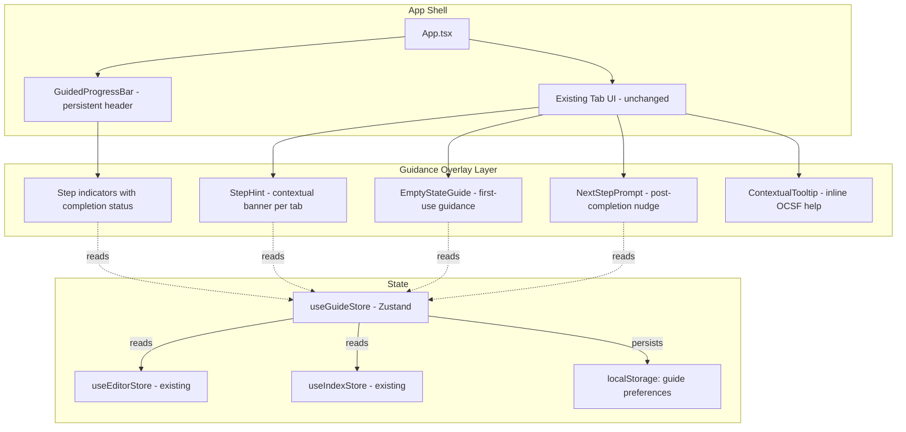
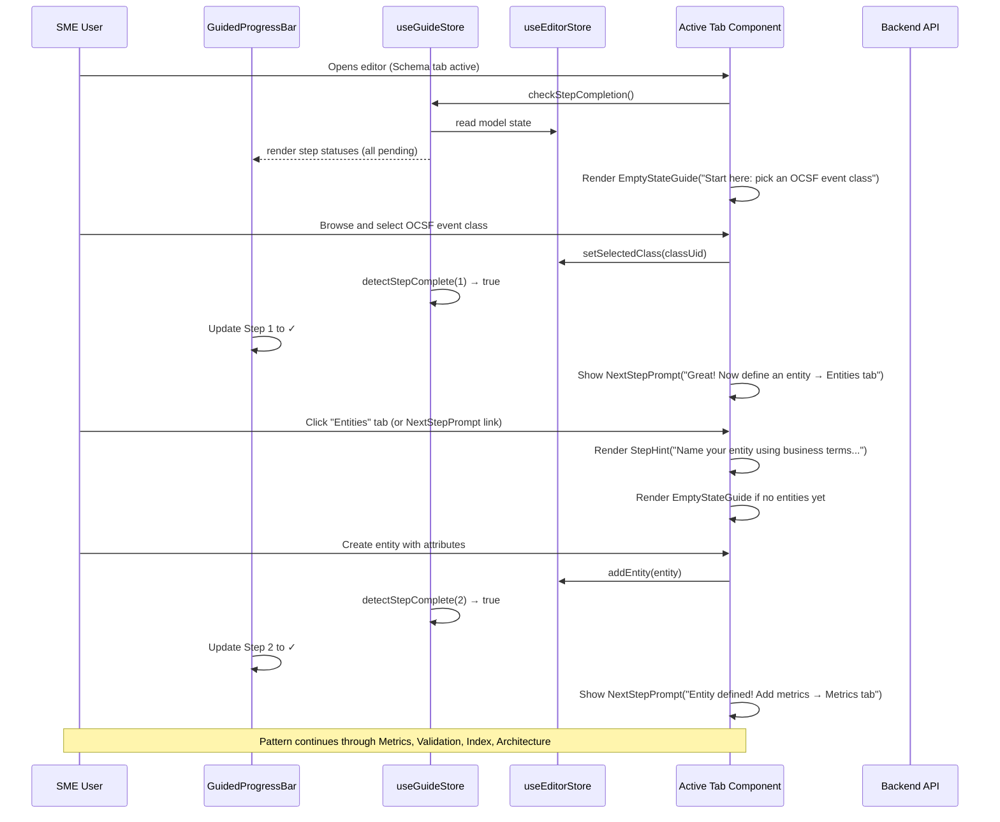
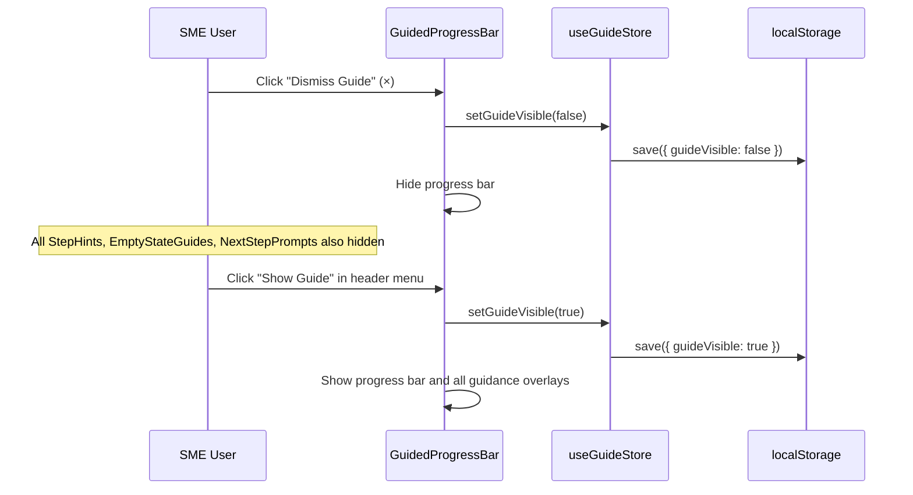

# Design Document: Guided Wizard Workflow for SME Semantic Layer Design

## Overview

The OCSF Semantic Model Editor currently presents 8 flat tabs (Schema, Entities, Metrics, Validation, Index, Architecture, Catalog, ETL) with no guidance on workflow order. Subject Matter Experts (SMEs) must rely on tribal knowledge to understand the correct sequence for building a semantic model. This creates a steep learning curve and leads to incomplete or incorrectly ordered model definitions.

Rather than introducing a separate wizard mode that replaces the tab UI, this design adds an onboarding guidance layer directly into the existing tabs. The approach consists of five overlay components: a persistent GuidedProgressBar across all tabs showing the 6-step workflow, contextual StepHint banners on each tab explaining what to do and why, EmptyStateGuide panels on tabs that haven't been used yet, NextStepPrompt nudges after completing work on a tab, and ContextualTooltip popovers explaining OCSF concepts inline. The existing tab structure remains exactly as-is — the guide is an enhancement layer, not a replacement. Power users can dismiss the guide entirely; SMEs get taught the workflow as they use the real UI.

The design layers a lightweight `useGuideStore` (Zustand) on top of the existing `useEditorStore` and `useIndexStore` to track step completion. Step completion is inferred from model state (e.g., "has at least one entity" = Step 2 complete) rather than requiring explicit wizard actions. No new backend endpoints are required — the guide reads existing model/index state and provides contextual help.

## Architecture



## Sequence Diagrams

### SME Guided Workflow (Using Existing Tabs)



### Guide Dismissal Flow



## Components and Interfaces

### Component 1: GuidedProgressBar

**Purpose**: Persistent horizontal progress bar rendered between the header tabs and the main content area. Shows the 6 workflow steps with completion status. Always visible when guide is active.

**Interface**:
```typescript
interface GuidedProgressBarProps {
  steps: GuideStep[];
  currentTab: TabId;
  onStepClick: (step: GuideStep) => void;  // navigates to the step's tab
  onDismiss: () => void;
}

interface GuideStep {
  id: GuideStepId;
  label: string;
  targetTab: TabId;
  status: StepStatus;
  description: string;
}

type GuideStepId = 1 | 2 | 3 | 4 | 5 | 6;
type StepStatus = 'pending' | 'active' | 'complete';
```

**Responsibilities**:
- Render a compact horizontal bar with 6 numbered step indicators
- Highlight the step corresponding to the currently active tab
- Show checkmarks on completed steps, dots on pending steps
- Clicking a step navigates to that step's associated tab
- Dismiss button (×) hides the entire guide layer
- Render below the tab navigation, above the main content

**Step-to-Tab Mapping**:
| Step | Label | Target Tab |
|------|-------|------------|
| 1 | Select Event Class | schema |
| 2 | Define Entity | entities |
| 3 | Map Fields & Attributes | entities |
| 4 | Add Metrics | metrics |
| 5 | Validate Model | validation |
| 6 | Register in Index | index |

### Component 2: StepHint

**Purpose**: Contextual banner displayed at the top of a tab's content area, explaining what the SME should do on this tab and why it matters in the workflow.

**Interface**:
```typescript
interface StepHintProps {
  stepId: GuideStepId;
  tabId: TabId;
  isStepComplete: boolean;
  onDismissHint: (stepId: GuideStepId) => void;
}
```

**Responsibilities**:
- Render a colored info banner with icon, title, and description
- Show different content based on whether the step is pending vs complete
- Collapsible per-step (user can dismiss individual hints)
- Include links to OCSF documentation where relevant
- Render at the top of the tab content, pushing existing content down

**Hint Content by Tab**:
| Tab | Hint Title | Hint Description |
|-----|-----------|-----------------|
| schema | Step 1: Select an Event Class | Browse the OCSF schema tree and select the event class that matches your data source. This determines which attributes are available for your semantic entity. |
| entities | Step 2-3: Define Your Entity | Create a semantic entity that maps business concepts to OCSF fields. Give it a meaningful name, then select and map the attributes you need. |
| metrics | Step 4: Define Metrics | Add aggregation metrics (count, sum, avg) over your entity's attributes. These power dashboards and analytics queries. |
| validation | Step 5: Validate Your Model | Run validation to check your entity definitions, metric expressions, and attribute mappings for errors before registering. |
| index | Step 6: Register in Index | Register your physical table and map source-to-OCSF field lineage. This connects your semantic model to actual data. |
| architecture | Architecture View | View the visual architecture of your semantic model. This is auto-generated from your entities and relationships. |
| catalog | Catalog | Browse and manage catalog entries for your semantic model artifacts. |
| etl | ETL Pipelines | Configure ETL pipelines to transform raw data into OCSF-normalized tables. |

### Component 3: EmptyStateGuide

**Purpose**: Replaces the default empty state of a tab with guided instructions when the tab has no content yet and the guide is active.

**Interface**:
```typescript
interface EmptyStateGuideProps {
  tabId: TabId;
  stepId: GuideStepId | null;  // null for tabs not in the 6-step flow
  prerequisitesMet: boolean;    // whether prior steps are complete
  onNavigateToPrerequisite: (tab: TabId) => void;
}
```

**Responsibilities**:
- Show a friendly empty state with illustration/icon and clear call-to-action
- If prerequisites are not met, explain what needs to be done first and link to the prerequisite tab
- If prerequisites are met, show the primary action for this tab
- Render only when the tab's content is empty AND guide is active
- Falls back to the existing empty state when guide is dismissed

**Empty State Content Examples**:
- Schema tab (no class selected): "👋 Start here! Browse the OCSF schema tree on the left and select an event class like DNS Activity or Process Activity."
- Entities tab (no entities, no class selected): "⚠️ First, select an OCSF event class in the Schema tab. → Go to Schema"
- Entities tab (no entities, class selected): "✅ Great, you selected {className}! Now click '+ New Entity' to create a semantic entity based on this class."
- Metrics tab (no metrics, no entities): "⚠️ Define at least one entity first. → Go to Entities"
- Metrics tab (no metrics, has entities): "Ready to add metrics! Click '+ New Metric' to define aggregations over your entity attributes."

### Component 4: NextStepPrompt

**Purpose**: A toast/banner that appears after the SME completes meaningful work on a tab, nudging them to the next step in the workflow.

**Interface**:
```typescript
interface NextStepPromptProps {
  completedStepId: GuideStepId;
  nextStepId: GuideStepId | null;  // null if all steps complete
  nextTabId: TabId | null;
  onNavigate: (tab: TabId) => void;
  onDismiss: () => void;
}
```

**Responsibilities**:
- Appear as a slide-in banner at the bottom of the content area
- Show congratulatory message + next step suggestion
- Include a button to navigate to the next tab
- Auto-dismiss after 10 seconds or on user click
- Only show once per step completion (tracked in useGuideStore)

**Prompt Messages**:
| Completed Step | Message | Action |
|---------------|---------|--------|
| 1 (Event Class) | "Event class selected! Next: define a semantic entity." | → Entities tab |
| 2 (Entity) | "Entity created! Next: add metrics for analytics." | → Metrics tab |
| 3 (Fields) | "Fields mapped! Next: add metrics for analytics." | → Metrics tab |
| 4 (Metrics) | "Metrics defined! Next: validate your model." | → Validation tab |
| 5 (Validation) | "Model validated! Next: register your table in the index." | → Index tab |
| 6 (Index) | "🎉 All steps complete! Your semantic model is ready." | (none) |

### Component 5: ContextualTooltip

**Purpose**: Inline tooltip/popover that explains OCSF concepts where they appear in the UI. Triggered by hovering or clicking a help icon (?) next to OCSF-specific terms.

**Interface**:
```typescript
interface ContextualTooltipProps {
  term: OCSFTerm;
  children: React.ReactNode;  // the element to attach the tooltip to
}

type OCSFTerm =
  | 'event_class'
  | 'category'
  | 'attribute'
  | 'observable'
  | 'dimension'
  | 'metric'
  | 'semantic_entity'
  | 'field_mapping'
  | 'source_lineage'
  | 'detection_coverage'
  | 'mitre_technique'
  | 'hot_path'
  | 'time_granularity';
```

**Responsibilities**:
- Render a small (?) icon next to the wrapped content
- On hover/click, show a popover with a concise explanation of the OCSF term
- Include a "Learn more" link to OCSF documentation where applicable
- Only visible when guide is active
- Positioned to avoid overlapping other UI elements

**Tooltip Content (subset)**:
| Term | Tooltip |
|------|---------|
| event_class | An OCSF event class represents a specific type of security event (e.g., DNS Activity, Process Activity). Each class defines a set of attributes. |
| observable | An observable is a value that can be watched for threat detection — like an IP address, hostname, or file hash. |
| dimension | A dimension is an attribute used for grouping and filtering in analytics queries (e.g., group by source IP). |
| semantic_entity | A semantic entity maps business-friendly names to OCSF event class attributes, making queries more intuitive. |
| hot_path | A hot-path metric is pre-computed for real-time dashboards, trading storage for query speed. |

## Data Models

### GuideState

```typescript
interface GuideState {
  // Visibility
  guideVisible: boolean;
  dismissedHints: Set<GuideStepId>;  // per-step hint dismissals
  shownPrompts: Set<GuideStepId>;    // prompts already shown (don't repeat)

  // Step completion (derived from model state)
  stepStatuses: Record<GuideStepId, StepStatus>;

  // Active step (inferred from current tab)
  activeStepId: GuideStepId | null;
}

type GuideStepId = 1 | 2 | 3 | 4 | 5 | 6;
type StepStatus = 'pending' | 'active' | 'complete';
```

**Validation Rules**:
- Step completion is derived, not manually set:
  - Step 1 complete: `editorStore.model.source_event_classes.length > 0` OR a class is selected in SchemaBrowser
  - Step 2 complete: `editorStore.model.entities.length > 0`
  - Step 3 complete: At least one entity has `attributes.length > 0`
  - Step 4 complete: `editorStore.model.metrics.length > 0` (optional — can be skipped)
  - Step 5 complete: Validation has been run (tracked via a `lastValidationRun` timestamp in guideStore)
  - Step 6 complete: At least one table registered in index

### GuidePersistence (localStorage)

```typescript
interface GuideSaveState {
  version: 1;
  guideVisible: boolean;
  dismissedHints: number[];       // serialized Set<GuideStepId>
  shownPrompts: number[];         // serialized Set<GuideStepId>
  lastValidationRun: string | null;  // ISO timestamp
}
```

**Storage Key**: `ocsf-guide-preferences`

## Algorithmic Pseudocode

### Step Completion Detection

```typescript
function deriveStepStatuses(
  editorState: EditorState,
  indexState: IndexState,
  guideState: GuideState,
  activeTab: TabId
): Record<GuideStepId, StepStatus> {
  const statuses: Record<GuideStepId, StepStatus> = {
    1: 'pending', 2: 'pending', 3: 'pending',
    4: 'pending', 5: 'pending', 6: 'pending',
  };

  // Step 1: Event class selected
  const hasEventClass = editorState.model.entities.some(
    e => e.source_event_classes && e.source_event_classes.length > 0
  ) || editorState.selectedClassUid !== null;
  if (hasEventClass) statuses[1] = 'complete';

  // Step 2: Entity defined
  if (editorState.model.entities.length > 0) statuses[2] = 'complete';

  // Step 3: Fields mapped (at least one entity has attributes)
  const hasAttributes = editorState.model.entities.some(
    e => e.attributes && e.attributes.length > 0
  );
  if (hasAttributes) statuses[3] = 'complete';

  // Step 4: Metrics defined (optional — complete if any exist)
  if (editorState.model.metrics && editorState.model.metrics.length > 0) {
    statuses[4] = 'complete';
  }

  // Step 5: Validation run
  if (guideState.lastValidationRun !== null) statuses[5] = 'complete';

  // Step 6: Table registered in index
  if (indexState.tables && indexState.tables.length > 0) statuses[6] = 'complete';

  // Mark active step based on current tab
  const tabToStep: Partial<Record<TabId, GuideStepId>> = {
    schema: 1, entities: 2, metrics: 4, validation: 5, index: 6,
  };
  const activeStep = tabToStep[activeTab];
  if (activeStep && statuses[activeStep] !== 'complete') {
    statuses[activeStep] = 'active';
  }

  return statuses;
}
```

### Prerequisite Check for EmptyStateGuide

```typescript
function checkPrerequisites(
  stepId: GuideStepId,
  stepStatuses: Record<GuideStepId, StepStatus>
): { met: boolean; missingStep: GuideStepId | null; missingTab: TabId | null } {
  const prerequisites: Record<GuideStepId, GuideStepId[]> = {
    1: [],           // No prerequisites
    2: [1],          // Need event class
    3: [1, 2],       // Need event class + entity
    4: [1, 2, 3],    // Need entity with attributes
    5: [1, 2, 3],    // Need entity with attributes (metrics optional)
    6: [1, 2, 3, 5], // Need validated model
  };

  const stepToTab: Record<GuideStepId, TabId> = {
    1: 'schema', 2: 'entities', 3: 'entities',
    4: 'metrics', 5: 'validation', 6: 'index',
  };

  const required = prerequisites[stepId];
  for (const req of required) {
    if (stepStatuses[req] !== 'complete') {
      return { met: false, missingStep: req, missingTab: stepToTab[req] };
    }
  }
  return { met: true, missingStep: null, missingTab: null };
}
```

### NextStepPrompt Trigger Logic

```typescript
function shouldShowNextPrompt(
  completedStepId: GuideStepId,
  guideState: GuideState
): boolean {
  // Don't show if guide is hidden
  if (!guideState.guideVisible) return false;
  // Don't show if already shown for this step
  if (guideState.shownPrompts.has(completedStepId)) return false;
  // Show the prompt
  return true;
}

function getNextStep(completedStepId: GuideStepId): {
  nextStepId: GuideStepId | null;
  nextTab: TabId | null;
} {
  const nextMap: Record<GuideStepId, { nextStepId: GuideStepId | null; nextTab: TabId | null }> = {
    1: { nextStepId: 2, nextTab: 'entities' },
    2: { nextStepId: 4, nextTab: 'metrics' },
    3: { nextStepId: 4, nextTab: 'metrics' },
    4: { nextStepId: 5, nextTab: 'validation' },
    5: { nextStepId: 6, nextTab: 'index' },
    6: { nextStepId: null, nextTab: null },
  };
  return nextMap[completedStepId];
}
```

## Key Functions with Formal Specifications

### useGuideStore (Zustand Store)

```typescript
interface GuideActions {
  // Visibility
  setGuideVisible: (visible: boolean) => void;
  dismissHint: (stepId: GuideStepId) => void;
  markPromptShown: (stepId: GuideStepId) => void;

  // Step tracking
  refreshStepStatuses: () => void;  // re-derive from model state
  markValidationRun: () => void;    // record that validation was executed

  // Reset
  resetGuide: () => void;  // clear all guide state (for new model)
}
```

**Preconditions for setGuideVisible(visible)**:
- `visible` is a boolean

**Postconditions for setGuideVisible(visible)**:
- `guideState.guideVisible === visible`
- Persisted to localStorage
- All overlay components (StepHint, EmptyStateGuide, NextStepPrompt, ContextualTooltip) respect the new visibility

**Preconditions for refreshStepStatuses()**:
- editorStore and indexStore are initialized

**Postconditions for refreshStepStatuses()**:
- `stepStatuses` reflects current model state via `deriveStepStatuses()`
- No side effects on editorStore or indexStore

**Preconditions for markValidationRun()**:
- Validation panel has been opened and validation executed

**Postconditions for markValidationRun()**:
- `lastValidationRun` set to current ISO timestamp
- Step 5 status becomes 'complete' on next `refreshStepStatuses()` call

### Integration Points in App.tsx

```typescript
// App.tsx additions (no structural changes to existing tabs)
function App() {
  // ... existing state ...
  const guideVisible = useGuideStore(s => s.guideVisible);
  const stepStatuses = useGuideStore(s => s.stepStatuses);
  const refreshStepStatuses = useGuideStore(s => s.refreshStepStatuses);

  // Refresh step statuses when model changes
  useEffect(() => {
    refreshStepStatuses();
  }, [editorStore.model, indexStore.tables]);

  return (
    <div className="app">
      <header className="header">
        {/* ... existing header, tabs, actions — UNCHANGED ... */}
      </header>

      {/* NEW: Guided progress bar between header and content */}
      {guideVisible && (
        <GuidedProgressBar
          steps={buildGuideSteps(stepStatuses)}
          currentTab={activeTab}
          onStepClick={(step) => setActiveTab(step.targetTab)}
          onDismiss={() => useGuideStore.getState().setGuideVisible(false)}
        />
      )}

      <main className="content">
        {/* ... existing sidebar and main-panel — UNCHANGED ... */}
        {/* StepHint, EmptyStateGuide, NextStepPrompt rendered INSIDE each tab component */}
      </main>
    </div>
  );
}
```

## Example Usage

```typescript
// 1. Guide is visible by default for new models
const guideVisible = useGuideStore(s => s.guideVisible); // true

// 2. SME opens Schema tab — sees EmptyStateGuide
// "👋 Start here! Browse the OCSF schema tree and select an event class."

// 3. SME selects DNS Activity class
// useGuideStore auto-detects step 1 complete via model state
// NextStepPrompt appears: "Event class selected! Next: define a semantic entity. → Entities"

// 4. SME clicks "Entities" in the NextStepPrompt
setActiveTab('entities');
// StepHint banner: "Name your entity using business terms that your analysts understand."
// EmptyStateGuide: "Click '+ New Entity' to create a semantic entity based on DNS Activity."

// 5. SME creates entity with attributes
// Steps 2 and 3 auto-complete
// NextStepPrompt: "Entity defined! Add metrics → Metrics tab"

// 6. SME can dismiss the guide at any time
useGuideStore.getState().setGuideVisible(false);
// All guidance overlays disappear, tabs work exactly as before

// 7. SME can re-enable the guide
useGuideStore.getState().setGuideVisible(true);
// Progress bar and hints reappear, showing current completion state
```

## Correctness Properties

*A property is a characteristic or behavior that should hold true across all valid executions of a system — essentially, a formal statement about what the system should do. Properties serve as the bridge between human-readable specifications and machine-verifiable correctness guarantees.*

### Property 1: Guide state persistence round-trip

*For any* valid GuideState (guideVisible, dismissedHints, shownPrompts, lastValidationRun), serializing the state to localStorage under the "ocsf-guide-preferences" key and then deserializing it back SHALL produce an equivalent GuideState.

**Validates: Requirements 1.2, 1.4, 1.5, 9.1, 9.2, 9.3**

### Property 2: Step derivation purity

*For any* EditorStore state, IndexStore state, GuideStore state, and active tab, calling `deriveStepStatuses` multiple times with the same inputs SHALL produce identical step status records.

**Validates: Requirements 3.1, 3.8**

### Property 3: Step completion correctness

*For any* randomly generated EditorStore and IndexStore state, `deriveStepStatuses` SHALL mark each step as complete if and only if its condition is met: Step 1 when an entity has source_event_classes or a class is selected, Step 2 when entities exist, Step 3 when any entity has attributes, Step 4 when metrics exist, Step 5 when lastValidationRun is not null, Step 6 when tables are registered in the index.

**Validates: Requirements 3.2, 3.3, 3.4, 3.5, 3.6, 3.7**

### Property 4: Prerequisite enforcement correctness

*For any* step and set of step statuses, `checkPrerequisites` SHALL return met=false with the correct missing step and tab when any prerequisite in the defined dependency chain is not complete, and met=true when all prerequisites are complete.

**Validates: Requirements 4.1, 4.2, 4.3**

### Property 5: Step indicator rendering correctness

*For any* step and its status (pending, active, complete), the GuidedProgressBar SHALL render the correct visual indicator: checkmark for complete, dot for pending, highlighted for active. Clicking any step SHALL navigate to its mapped tab.

**Validates: Requirements 2.3, 2.4, 2.5, 2.6**

### Property 6: StepHint content and dismissal correctness

*For any* tab and step status combination, the StepHint SHALL render the appropriate content (pending vs complete). *For any* step whose hint has been dismissed, the StepHint for that step SHALL not render.

**Validates: Requirements 5.1, 5.2, 5.3**

### Property 7: Prompt uniqueness

*For any* sequence of step completions and guide state, `shouldShowNextPrompt` SHALL return true at most once per step. After `markPromptShown` is called for a step, `shouldShowNextPrompt` SHALL return false for that step regardless of subsequent state changes.

**Validates: Requirements 6.1, 6.6**

### Property 8: Guide visibility independence

*For any* model operation performed on the EditorStore or IndexStore, the operation result SHALL be identical regardless of whether guideVisible is true or false. The Guide_Layer SHALL not modify, reorder, or replace any existing tab components.

**Validates: Requirements 8.1, 8.2**

### Property 9: Tooltip content correctness

*For any* OCSF term in the defined OCSFTerm type, the ContextualTooltip SHALL display the correct explanation text when triggered.

**Validates: Requirement 7.2**

### Property 10: Graceful degradation on malformed state

*For any* EditorStore model with missing or unexpected fields, `deriveStepStatuses` SHALL default affected steps to "not complete" without throwing an exception. The Guide_Layer SHALL never throw an unhandled exception that prevents the Tab_UI from rendering.

**Validates: Requirements 10.4, 11.2, 11.4**

### Property 11: Model sync triggers re-derivation

*For any* change to EditorStore or IndexStore state (including import, undo, redo), the GuideStore SHALL re-derive step statuses so that `stepStatuses` reflects the updated model state.

**Validates: Requirements 10.1, 10.2, 10.3**

## Error Handling

### Error Scenario 1: localStorage Unavailable

**Condition**: Browser blocks localStorage (private browsing, quota exceeded)
**Response**: Guide operates in-memory only. Preferences reset on page reload.
**Recovery**: No action needed — guide defaults to visible with no dismissed hints.

### Error Scenario 2: Model State Inconsistency

**Condition**: `deriveStepStatuses` encounters unexpected model shape (e.g., entity without `source_event_classes` field)
**Response**: Treat missing fields as "step not complete" (safe default). Log warning to console.
**Recovery**: Step status updates correctly once model state is corrected.

### Error Scenario 3: Guide Store Out of Sync

**Condition**: Model changes externally (import, undo/redo) without triggering `refreshStepStatuses`
**Response**: Subscribe to editorStore and indexStore changes to auto-refresh.
**Recovery**: `useEffect` dependency on model state ensures statuses are always current.

### Error Scenario 4: Tooltip Positioning Overflow

**Condition**: ContextualTooltip renders outside viewport on small screens
**Response**: Use CSS `position: fixed` with viewport boundary detection to flip tooltip direction.
**Recovery**: Automatic — tooltip repositions on render.

## Testing Strategy

### Unit Testing Approach

- Test `deriveStepStatuses()` with various model states (empty, partial, complete)
- Test `checkPrerequisites()` for each step with all prerequisite combinations
- Test `shouldShowNextPrompt()` with various guide states
- Test `getNextStep()` mapping for all step IDs
- Test localStorage persistence round-trip for GuideSaveState

### Property-Based Testing Approach

**Property Test Library**: fast-check

- **Step derivation purity**: For any randomly generated EditorState and IndexState, `deriveStepStatuses` called twice with same inputs returns identical results
- **Prerequisite monotonicity**: For any model state where step N is complete, adding more data to the model never makes step N incomplete
- **Guide visibility independence**: For any model operation, the operation result is identical regardless of `guideVisible` value
- **Prompt uniqueness**: For any sequence of step completions, each step's NextStepPrompt appears at most once

### Integration Testing Approach

- Test full SME workflow: Schema → Entities → Metrics → Validation → Index with guide active
- Test guide dismissal persists across page reloads
- Test guide re-enable shows correct current step statuses
- Test import/undo/redo correctly updates step statuses
- Test EmptyStateGuide shows correct prerequisite messages

## Performance Considerations

- `deriveStepStatuses` is a lightweight pure function reading existing store state — no API calls
- Step status refresh is debounced (100ms) to avoid excessive re-renders during rapid model edits
- ContextualTooltip content is statically defined (no runtime fetching)
- GuidedProgressBar uses CSS transitions for step status changes (no JS animation)
- Guide components are conditionally rendered (`guideVisible &&`) — zero overhead when dismissed

## Security Considerations

- Guide state in localStorage contains only UI preferences (visibility, dismissed hints) — no sensitive data
- No new API endpoints or backend changes required
- ContextualTooltip content is hardcoded — no XSS vector from dynamic content

## Dependencies

- Existing: React, Zustand, existing component library
- No new external dependencies required
- Reuses existing stores: `useEditorStore`, `useIndexStore`
- Reuses existing tab components: all existing components remain unchanged
