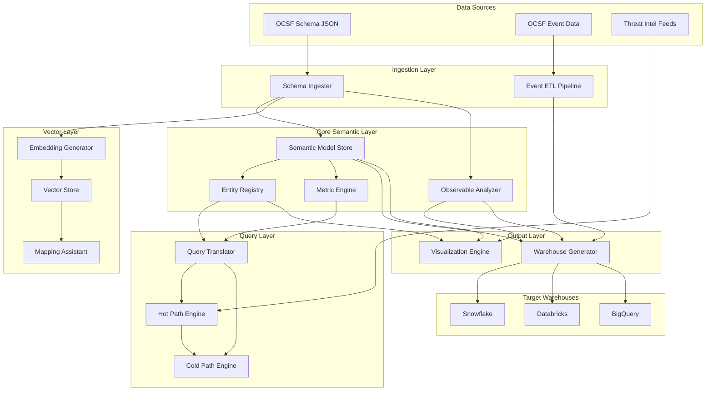
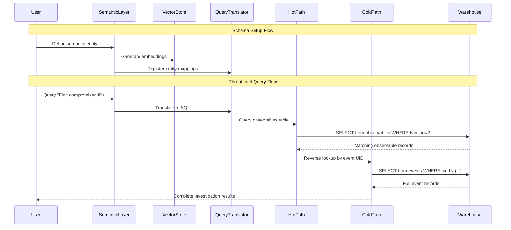
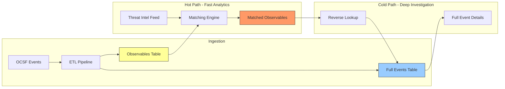

# Design Document: OCSF Semantic Layer

## Overview

This design defines a semantic layer architecture for the Open Cybersecurity Schema Framework (OCSF) that bridges the gap between OCSF's physical JSON schema and business-level security concepts. The system provides:

1. **Semantic abstraction** over OCSF's nested event structure
2. **Visual representation** of semantic-to-physical layer interchange
3. **Vector embeddings** for intelligent field mapping assistance
4. **Observable analysis** to determine semantic layer coverage
5. **Hot/cold path analytics** for threat intelligence workflows
6. **Warehouse artifact generation** for deployment to target platforms

The architecture follows a layered approach where the semantic layer acts as a logical view over the physical OCSF schema, with vector embeddings enabling AI-assisted mapping and query translation.

## Architecture



### Data Flow



## Components and Interfaces

### 1. Schema Ingester

Responsible for loading and parsing OCSF schema definitions.

```typescript
interface SchemaIngester {
  // Load OCSF schema from source
  loadSchema(source: SchemaSource): Promise<OCSFSchema>;
  
  // Extract all schema elements
  extractCategories(): Category[];
  extractEventClasses(): EventClass[];
  extractObjects(): OCSFObject[];
  extractAttributes(): Attribute[];
  extractObservables(): ObservableDefinition[];
  
  // Version management
  detectSchemaVersion(): string;
  compareVersions(v1: string, v2: string): SchemaDiff;
}

interface SchemaSource {
  type: 'local' | 'github' | 'url';
  path: string;
  version?: string;
}

interface OCSFSchema {
  version: string;
  categories: Map<number, Category>;
  eventClasses: Map<number, EventClass>;
  objects: Map<string, OCSFObject>;
  attributes: Map<string, Attribute>;
  observables: ObservableDefinition[];
}


interface Category {
  uid: number;
  name: string;
  caption: string;
  description: string;
  eventClasses: number[]; // class_uids
}

interface EventClass {
  class_uid: number;
  category_uid: number;
  name: string;
  caption: string;
  description: string;
  attributes: AttributeRef[];
  observables: ObservableDefinition[];
}

interface Attribute {
  name: string;
  type: string;
  caption: string;
  description: string;
  requirement: 'required' | 'recommended' | 'optional';
  observable?: number; // type_id if observable
}
```

### 2. Semantic Model Store

Manages semantic entity definitions and their mappings to OCSF.

```typescript
interface SemanticModelStore {
  // Entity management
  defineEntity(entity: SemanticEntity): void;
  getEntity(name: string): SemanticEntity | undefined;
  listEntities(): SemanticEntity[];
  
  // Metric management
  defineMetric(metric: SemanticMetric): void;
  getMetric(name: string): SemanticMetric | undefined;
  listMetrics(): SemanticMetric[];
  
  // Persistence
  save(path: string): Promise<void>;
  load(path: string): Promise<void>;
  exportYAML(): string;
  
  // Validation
  validate(schema: OCSFSchema): ValidationResult;
  
  // Versioning
  getVersion(): string;
  getHistory(): ChangeRecord[];
}

interface SemanticEntity {
  name: string;
  caption: string;
  description: string;
  
  // OCSF mappings
  sourceEventClasses: number[]; // class_uids this entity draws from
  
  // Attribute mappings
  attributes: SemanticAttribute[];
  
  // Relationships to other entities
  relationships: EntityRelationship[];
  
  // Observable coverage
  coversObservables?: number[]; // observable type_ids this entity covers
}

interface SemanticAttribute {
  name: string;           // Business-friendly name
  caption: string;
  description: string;
  type: SemanticType;
  
  // Mapping to OCSF
  ocsfMapping: OCSFMapping;
  
  // For dimensions
  isDimension?: boolean;
  
  // Sample values for embedding
  sampleValues?: string[];
}

interface OCSFMapping {
  // Simple field reference
  field?: string;  // e.g., "actor.user.name"
  
  // Expression for computed fields
  expression?: string;  // e.g., "COALESCE(src_endpoint.ip, src_endpoint.hostname)"
  
  // Join conditions for cross-class mappings
  joinCondition?: string;
}

interface SemanticMetric {
  name: string;
  caption: string;
  description: string;
  
  // Aggregation
  aggregation: 'count' | 'sum' | 'avg' | 'min' | 'max' | 'count_distinct';
  
  // Source field or expression
  measure: OCSFMapping;
  
  // Applicable dimensions
  dimensions: string[];  // References to SemanticAttribute names
  
  // Time dimension support
  timeGranularities: ('minute' | 'hour' | 'day' | 'week' | 'month')[];
  
  // For hot path metrics
  isHotPath?: boolean;
  observableTypeId?: number;  // If metric operates on observables table
}

interface EntityRelationship {
  name: string;
  targetEntity: string;
  cardinality: 'one-to-one' | 'one-to-many' | 'many-to-many';
  joinCondition: string;
}
```

### 3. Observable Analyzer

Analyzes OCSF observables and their relationship to semantic entities.

```typescript
interface ObservableAnalyzer {
  // Extract observables from schema
  extractObservables(schema: OCSFSchema): ObservableDefinition[];
  
  // Analyze coverage
  analyzeSemanticCoverage(
    observables: ObservableDefinition[],
    entities: SemanticEntity[]
  ): ObservableCoverageReport;
  
  // Generate compatibility report
  generateCompatibilityReport(): CompatibilityReport;
}

interface ObservableDefinition {
  typeId: number;
  typeName: string;
  definitionType: 'by_type' | 'by_attribute' | 'by_object' | 'by_event_class' | 'by_path';
  sourcePath?: string;  // For path-based observables
  sourceEventClass?: number;
  description: string;
}

interface ObservableCoverageReport {
  totalObservables: number;
  coveredBySemanticLayer: number;
  partiallyCovered: number;
  notCovered: number;
  
  details: ObservableCoverageDetail[];
}

interface ObservableCoverageDetail {
  observable: ObservableDefinition;
  status: 'fully_covered' | 'partially_covered' | 'not_covered' | 'essential';
  coveringEntities: string[];  // Entity names that cover this observable
  recommendation: string;
}

interface CompatibilityReport {
  schemaVersion: string;
  semanticModelVersion: string;
  
  // Observables that should be kept
  essentialObservables: ObservableDefinition[];
  
  // Observables that can be replaced by semantic layer
  redundantObservables: ObservableDefinition[];
  
  // Gaps in semantic coverage
  coverageGaps: CoverageGap[];
}

interface CoverageGap {
  observableTypeId: number;
  description: string;
  suggestedEntity: SemanticEntity;  // Auto-generated suggestion
}
```

### 4. Embedding Generator and Vector Store

Generates and stores vector embeddings for semantic search.

```typescript
interface EmbeddingGenerator {
  // Generate embeddings
  generateForSchema(schema: OCSFSchema): Promise<SchemaEmbeddings>;
  generateForEntity(entity: SemanticEntity): Promise<EntityEmbedding>;
  
  // Incremental updates
  updateEmbeddings(changes: SchemaChange[]): Promise<void>;
  
  // Configuration
  setModel(model: EmbeddingModel): void;
}

interface EmbeddingModel {
  type: 'sentence-transformers' | 'openai' | 'cohere';
  modelName: string;
  dimensions: number;
}

interface VectorStore {
  // Storage
  store(embeddings: Embedding[]): Promise<void>;
  
  // Search
  similaritySearch(
    query: string | number[],
    topK: number,
    filter?: VectorFilter
  ): Promise<SimilarityResult[]>;
  
  // Management
  delete(ids: string[]): Promise<void>;
  clear(): Promise<void>;
}

interface Embedding {
  id: string;
  vector: number[];
  metadata: {
    type: 'ocsf_attribute' | 'ocsf_class' | 'semantic_entity' | 'semantic_attribute';
    name: string;
    description: string;
    path?: string;
    sampleValues?: string[];
  };
}

interface SimilarityResult {
  id: string;
  score: number;
  metadata: Embedding['metadata'];
}
```

### 5. Mapping Assistant

Provides AI-assisted mapping suggestions.

```typescript
interface MappingAssistant {
  // Suggest mappings for source fields
  suggestMappings(
    sourceField: SourceFieldMetadata,
    topK?: number
  ): Promise<MappingSuggestion[]>;
  
  // Learn from confirmed mappings
  confirmMapping(
    sourceField: SourceFieldMetadata,
    targetMapping: OCSFMapping
  ): Promise<void>;
  
  // Batch suggestions
  suggestBatchMappings(
    sourceFields: SourceFieldMetadata[]
  ): Promise<Map<string, MappingSuggestion[]>>;
}

interface SourceFieldMetadata {
  name: string;
  type: string;
  description?: string;
  sampleValues?: string[];
  sourceSystem?: string;
}

interface MappingSuggestion {
  targetField: string;  // OCSF field path
  confidence: number;   // 0-1 score
  reasoning: string;    // Explanation for the suggestion
  alternativeFields?: string[];  // Other possible matches
}
```

### 6. Query Translator

Translates semantic queries to warehouse-specific SQL.

```typescript
interface QueryTranslator {
  // Translate semantic query to SQL
  translate(
    query: SemanticQuery,
    dialect: WarehouseDialect
  ): TranslatedQuery;
  
  // Generate reverse lookup query
  generateReverseLookup(
    observableMatches: ObservableMatch[],
    dialect: WarehouseDialect
  ): TranslatedQuery;
}

interface SemanticQuery {
  // Entity to query
  entity: string;
  
  // Attributes to select
  select: string[];
  
  // Filters
  where?: QueryFilter[];
  
  // Metrics to calculate
  metrics?: string[];
  
  // Grouping
  groupBy?: string[];
  
  // Time range
  timeRange?: TimeRange;
  
  // Query path preference
  pathPreference?: 'hot' | 'cold' | 'auto';
}

interface TranslatedQuery {
  sql: string;
  parameters: Record<string, any>;
  estimatedCost?: QueryCost;
  usesHotPath: boolean;
}

type WarehouseDialect = 'snowflake' | 'databricks' | 'bigquery' | 'postgres';
```

### 7. Warehouse Generator

Generates warehouse-specific deployment artifacts.

```typescript
interface WarehouseGenerator {
  // Generate semantic layer artifacts
  generateDBTSemanticLayer(model: SemanticModelStore): DBTArtifacts;
  generateCubeSchema(model: SemanticModelStore): CubeArtifacts;
  
  // Generate physical layer artifacts
  generateOCSFTables(schema: OCSFSchema, dialect: WarehouseDialect): TableDefinitions;
  generateObservablesTable(schema: OCSFSchema, dialect: WarehouseDialect): TableDefinition;
  
  // Generate views
  generateSemanticViews(
    model: SemanticModelStore,
    dialect: WarehouseDialect
  ): ViewDefinitions;
  
  // Generate ETL
  generateETLPipeline(
    schema: OCSFSchema,
    includeObservablesExtraction: boolean
  ): ETLDefinition;
  
  // Migration support
  generateMigration(
    fromVersion: string,
    toVersion: string,
    dialect: WarehouseDialect
  ): MigrationScript;
}

interface DBTArtifacts {
  semanticManifest: string;  // YAML
  models: Map<string, string>;  // model name -> SQL
  sources: string;  // YAML
}

interface TableDefinition {
  name: string;
  columns: ColumnDefinition[];
  partitionBy?: string[];
  clusterBy?: string[];
  createStatement: string;
}

interface ColumnDefinition {
  name: string;
  type: string;
  nullable: boolean;
  description: string;
}
```

### 8. Visualization Engine

Renders the semantic-to-physical layer interchange.

```typescript
interface VisualizationEngine {
  // Generate graph data
  generateGraph(
    model: SemanticModelStore,
    schema: OCSFSchema,
    options: VisualizationOptions
  ): GraphData;
  
  // Export formats
  exportSVG(graph: GraphData): string;
  exportPNG(graph: GraphData): Promise<Buffer>;
  exportJSON(graph: GraphData): string;
  
  // Interactive features
  highlightEntity(entityName: string): GraphData;
  highlightObservable(typeId: number): GraphData;
  filterByCategory(categoryUid: number): GraphData;
}

interface VisualizationOptions {
  viewMode: 'semantic_only' | 'physical_only' | 'interchange' | 'hot_cold_path';
  showObservables: boolean;
  showRelationships: boolean;
  layout: 'hierarchical' | 'force' | 'radial';
}

interface GraphData {
  nodes: GraphNode[];
  edges: GraphEdge[];
  metadata: {
    viewMode: string;
    generatedAt: Date;
  };
}

interface GraphNode {
  id: string;
  type: 'semantic_entity' | 'ocsf_category' | 'ocsf_class' | 'ocsf_attribute' | 'observable' | 'hot_path' | 'cold_path';
  label: string;
  properties: Record<string, any>;
  style: NodeStyle;
}

interface GraphEdge {
  source: string;
  target: string;
  type: 'maps_to' | 'contains' | 'relates_to' | 'covers_observable' | 'reverse_lookup';
  label?: string;
  style: EdgeStyle;
}

interface NodeStyle {
  shape: 'rectangle' | 'ellipse' | 'diamond' | 'hexagon';
  color: string;
  borderColor: string;
  icon?: string;
}

interface EdgeStyle {
  lineStyle: 'solid' | 'dashed' | 'dotted';
  color: string;
  arrowHead: 'normal' | 'none' | 'diamond';
}
```


## Data Models

### Semantic Model YAML Schema

```yaml
# semantic-model.yaml
version: "1.0"
ocsf_version: "1.4.0"
name: "security-analytics"
description: "Semantic layer for security analytics on OCSF data"

entities:
  - name: authentication_event
    caption: "Authentication Event"
    description: "User authentication attempts across all systems"
    source_event_classes:
      - 3002  # Authentication
      - 3003  # Account Change
    covers_observables:
      - 5   # email_t
      - 10  # user_name
    attributes:
      - name: user_email
        caption: "User Email"
        type: string
        ocsf_mapping:
          field: "actor.user.email_addr"
        is_dimension: true
        sample_values: ["user@example.com"]
      
      - name: auth_result
        caption: "Authentication Result"
        type: string
        ocsf_mapping:
          expression: "CASE WHEN status_id = 1 THEN 'success' ELSE 'failure' END"
        is_dimension: true
      
      - name: source_ip
        caption: "Source IP Address"
        type: string
        ocsf_mapping:
          field: "src_endpoint.ip"
        is_dimension: true
    
    relationships:
      - name: performed_by
        target_entity: user
        cardinality: many-to-one
        join_condition: "authentication_event.user_email = user.email"

  - name: user
    caption: "User"
    description: "User entity aggregated from identity events"
    source_event_classes:
      - 3001  # User Access Management
      - 3002  # Authentication
    attributes:
      - name: email
        caption: "Email Address"
        type: string
        ocsf_mapping:
          field: "user.email_addr"
        is_dimension: true
      
      - name: name
        caption: "Display Name"
        type: string
        ocsf_mapping:
          field: "user.name"

metrics:
  - name: auth_attempts
    caption: "Authentication Attempts"
    description: "Count of authentication attempts"
    aggregation: count
    measure:
      field: "metadata.uid"
    dimensions:
      - user_email
      - auth_result
      - source_ip
    time_granularities:
      - minute
      - hour
      - day
    is_hot_path: false

  - name: failed_auth_rate
    caption: "Failed Authentication Rate"
    description: "Percentage of failed authentication attempts"
    aggregation: avg
    measure:
      expression: "CASE WHEN status_id != 1 THEN 1.0 ELSE 0.0 END"
    dimensions:
      - user_email
      - source_ip
    time_granularities:
      - hour
      - day

  - name: threat_intel_matches
    caption: "Threat Intel Matches"
    description: "Count of observables matching threat intelligence"
    aggregation: count
    measure:
      field: "observable_value"
    dimensions: []
    is_hot_path: true
    observable_type_id: 2  # IP addresses

observable_config:
  extract_to_table: true
  table_name: "ocsf_observables"
  include_types:
    - 2   # IP addresses
    - 5   # Email addresses
    - 10  # User names
    - 22  # Hostnames
    - 30  # File hashes
```

### Observables Table Schema

```sql
-- Dedicated observables table for hot path analytics
CREATE TABLE ocsf_observables (
    -- Observable identification
    observable_id       STRING NOT NULL,  -- Unique ID for this observable instance
    type_id            INTEGER NOT NULL,  -- OCSF observable type_id
    type_name          STRING NOT NULL,   -- Human-readable type name
    value              STRING,            -- Observable value (for primitives)
    
    -- Source event reference for reverse lookup
    event_uid          STRING NOT NULL,   -- Source event metadata.uid
    event_class_uid    INTEGER NOT NULL,  -- Source event class_uid
    event_time         TIMESTAMP NOT NULL, -- Source event time
    
    -- Path reference
    attribute_path     STRING NOT NULL,   -- Path to attribute in source event
    
    -- Partitioning and clustering
    ingestion_time     TIMESTAMP NOT NULL DEFAULT CURRENT_TIMESTAMP,
    
    -- Indexes for threat intel matching
    PRIMARY KEY (observable_id)
)
PARTITION BY DATE(event_time)
CLUSTER BY type_id, value;

-- Index for fast threat intel lookups
CREATE INDEX idx_observables_type_value ON ocsf_observables(type_id, value);

-- Index for reverse lookups
CREATE INDEX idx_observables_event_uid ON ocsf_observables(event_uid);
```

### Hot Path / Cold Path Data Flow




## Correctness Properties

*A property is a characteristic or behavior that should hold true across all valid executions of a system—essentially, a formal statement about what the system should do. Properties serve as the bridge between human-readable specifications and machine-verifiable correctness guarantees.*

### Property 1: Schema Parsing Completeness and Fidelity

*For any* valid OCSF schema JSON, parsing then serializing back to JSON should produce an equivalent schema with all categories, event classes, objects, attributes, and their metadata (types, requirements, descriptions) preserved.

**Validates: Requirements 1.2, 1.3, 1.5**

### Property 2: Semantic Entity Definition Round-Trip

*For any* valid semantic entity definition (with event class mappings, attributes, expressions, and relationships), saving to YAML then loading should produce an equivalent entity with all properties preserved.

**Validates: Requirements 2.1, 2.2, 2.3, 2.4, 9.1, 9.4**

### Property 3: Invalid Field Reference Detection

*For any* semantic entity definition that references non-existent OCSF fields, validation against a schema should return errors identifying the specific invalid field references.

**Validates: Requirements 2.5**

### Property 4: Metric Definition Round-Trip

*For any* valid semantic metric definition (with aggregation, measure, dimensions, and time granularities), saving then loading should produce an equivalent metric.

**Validates: Requirements 3.1, 3.2, 3.3, 3.4**

### Property 5: Graph Generation Completeness

*For any* semantic model with entities and OCSF schema, the generated visualization graph should contain nodes for all entities and edges to all mapped OCSF event classes.

**Validates: Requirements 4.1, 4.2**

### Property 6: View Mode Filtering

*For any* visualization graph and view mode (semantic_only, physical_only, interchange), the filtered graph should contain only nodes appropriate for that mode.

**Validates: Requirements 4.4**

### Property 7: Embedding Generation Consistency

*For any* OCSF attribute or semantic entity, generating embeddings multiple times with the same model should produce identical vectors.

**Validates: Requirements 5.1, 5.2**

### Property 8: Vector Similarity Search Ordering

*For any* query embedding and set of stored embeddings, similarity search results should be ordered by descending similarity score.

**Validates: Requirements 6.1, 6.2**

### Property 9: Mapping Suggestion Completeness

*For any* source field metadata, mapping suggestions should include a reasoning string for each suggestion.

**Validates: Requirements 6.3**

### Property 10: DBT Artifact Validity

*For any* semantic model, the generated dbt semantic layer YAML should be valid YAML that parses without errors.

**Validates: Requirements 7.2**

### Property 11: Cube.js Schema Validity

*For any* semantic model, the generated Cube.js schema should be valid JavaScript/TypeScript that parses without errors.

**Validates: Requirements 7.3**

### Property 12: SQL View Syntax Validity

*For any* semantic entity and warehouse dialect, the generated SQL view should be syntactically valid for that dialect.

**Validates: Requirements 7.5**

### Property 13: Query Translation Correctness

*For any* valid semantic query, the translated SQL should:
- Contain SELECT clauses for all requested attributes
- Contain JOIN clauses for all referenced entities
- Contain aggregations for all requested metrics

**Validates: Requirements 8.1, 8.2, 8.3**

### Property 14: Invalid Query Error Handling

*For any* semantic query referencing undefined entities or metrics, the translator should return an error (not throw an exception) with a descriptive message.

**Validates: Requirements 8.4**

### Property 15: Observable Extraction Completeness

*For any* OCSF schema, the observable analyzer should extract all observable definitions and correctly categorize them by definition type (by_type, by_attribute, by_object, by_event_class, by_path).

**Validates: Requirements 10.1**

### Property 16: Observable Coverage Analysis

*For any* set of observables and semantic entities, if an entity's attributes fully cover an observable's data path, the coverage report should mark that observable as covered.

**Validates: Requirements 10.2, 10.3, 10.4**

### Property 17: Observables Table Schema Completeness

*For any* warehouse dialect, the generated observables table schema should contain columns for: observable_id, type_id, type_name, value, event_uid, event_class_uid, event_time, and attribute_path.

**Validates: Requirements 11.1, 11.2**

### Property 18: Observable Extraction from Events

*For any* OCSF event with observables array, the ETL extraction should produce one observables table row per observable, with correct reverse-lookup references to the source event.

**Validates: Requirements 11.3**

### Property 19: Reverse Lookup Query Generation

*For any* set of observable matches (with event_uid values), the generated reverse-lookup query should retrieve all matching full events.

**Validates: Requirements 11.5**

### Property 20: Hot Path Query Routing

*For any* semantic query with pathPreference='hot' against a hot-path-enabled metric, the translated SQL should query the observables table, not the full events table.

**Validates: Requirements 11.4, 11.6**

## Error Handling

### Schema Ingestion Errors

| Error Condition | Handling |
|----------------|----------|
| Invalid JSON syntax | Return parse error with line/column |
| Missing required schema fields | Return validation error listing missing fields |
| Unknown OCSF version | Warn and attempt best-effort parsing |
| Network failure (GitHub source) | Retry with exponential backoff, then fail with clear message |

### Semantic Model Errors

| Error Condition | Handling |
|----------------|----------|
| Invalid OCSF field reference | Return validation error with field path and suggestions |
| Circular entity relationships | Detect during validation, return cycle description |
| Duplicate entity/metric names | Return conflict error with locations |
| Invalid aggregation expression | Return syntax error with position |

### Query Translation Errors

| Error Condition | Handling |
|----------------|----------|
| Unknown entity reference | Return error with entity name and available entities |
| Unknown metric reference | Return error with metric name and available metrics |
| Invalid time range | Return error with valid range format |
| Unsupported dialect feature | Return error with alternative approach |

### Vector Store Errors

| Error Condition | Handling |
|----------------|----------|
| Embedding model unavailable | Fall back to default model or return clear error |
| Vector dimension mismatch | Return error with expected vs actual dimensions |
| Storage capacity exceeded | Return error with cleanup suggestions |

## Testing Strategy

### Unit Tests

Unit tests verify specific examples and edge cases:

- Schema parsing with various OCSF versions
- Entity definition with different attribute types
- Metric calculations with edge case values
- SQL generation for each warehouse dialect
- Observable extraction from sample events

### Property-Based Tests

Property-based tests verify universal properties across generated inputs:

- **Framework**: Use fast-check (TypeScript) or Hypothesis (Python)
- **Minimum iterations**: 100 per property
- **Tag format**: `Feature: ocsf-semantic-layer, Property N: [property text]`

Each correctness property above should be implemented as a property-based test that:
1. Generates random valid inputs
2. Executes the operation
3. Verifies the property holds

### Integration Tests

- End-to-end flow: Schema → Semantic Model → Warehouse Artifacts
- Hot path → Cold path reverse lookup flow
- Vector embedding → Similarity search → Mapping suggestion flow

### Test Data Generation

```typescript
// Example generators for property-based testing
const ocsfAttributeGen = fc.record({
  name: fc.string({ minLength: 1, maxLength: 50 }).filter(s => /^[a-z_]+$/.test(s)),
  type: fc.constantFrom('string_t', 'integer_t', 'boolean_t', 'timestamp_t'),
  caption: fc.string({ minLength: 1, maxLength: 100 }),
  description: fc.string({ maxLength: 500 }),
  requirement: fc.constantFrom('required', 'recommended', 'optional')
});

const semanticEntityGen = fc.record({
  name: fc.string({ minLength: 1, maxLength: 50 }).filter(s => /^[a-z_]+$/.test(s)),
  caption: fc.string({ minLength: 1, maxLength: 100 }),
  sourceEventClasses: fc.array(fc.integer({ min: 1000, max: 9999 }), { minLength: 1, maxLength: 5 }),
  attributes: fc.array(semanticAttributeGen, { minLength: 1, maxLength: 20 })
});
```
