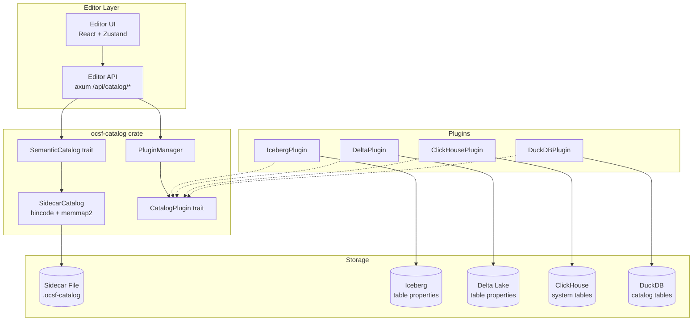

# Design Document: Semantic Catalog Plugins

## Overview

The `ocsf-catalog` crate provides a universal semantic catalog with a hybrid architecture: a compact binary sidecar file as the canonical source of truth, plus a plugin system for bidirectional sync with storage engines (Iceberg, Delta Lake, ClickHouse, DuckDB). The existing editor UI and API are extended to provide visual catalog management and plugin sync controls.

The design follows the project's established patterns: trait-based abstractions, builder pattern for complex structs, async operations with tokio, serde-based serialization, and thiserror for typed errors.

### Key Design Decisions

1. **Binary sidecar format**: Uses `bincode` for compact serialization with a fixed-size header containing magic number, version, checksum. Memory-mappable via `memmap2`.
2. **Trait-based plugin system**: `CatalogPlugin` trait mirrors the `IndexBackend` pattern — each engine implements push/pull/diff against its native metadata.
3. **JSON encoding for engine metadata**: All plugins serialize `CatalogEntry` sub-fields (attributes, detection coverage, lineage) as JSON strings within engine-native key-value metadata. This avoids engine-specific schema constraints.
4. **Last-writer-wins conflict resolution**: During bidirectional sync, the entry with the higher `catalog_version` wins. Simple, predictable, and avoids complex merge logic.
5. **Editor integration via axum router**: A new `create_catalog_router()` function follows the same pattern as `create_index_router()`, nested under `/api/catalog/`.

## Architecture



### Data Flow

1. **Write path**: Editor UI → Editor API → `SemanticCatalog::add/update` → serialize with bincode → write to sidecar file → increment catalog version → update checksum.
2. **Push sync**: Editor UI triggers push → `PluginManager::push(plugin_name)` → plugin reads entries from catalog → serializes to JSON → writes to engine-native metadata.
3. **Pull sync**: Editor UI triggers pull → `PluginManager::pull(plugin_name)` → plugin reads engine metadata → deserializes JSON → converts to `CatalogEntry` → merges into catalog.
4. **Read path**: Editor UI requests entries → Editor API → `SemanticCatalog::get/list` → read from memory-mapped sidecar → deserialize with bincode → return.

## Components and Interfaces

### SemanticCatalog Trait

```rust
/// Core catalog trait for reading and writing semantic metadata.
/// Follows the same async pattern as IndexBackend.
#[async_trait]
pub trait SemanticCatalog: Send + Sync {
    /// Add a new entry, returns its assigned CatalogEntryId.
    async fn add(&self, entry: CatalogEntry) -> CatalogResult<CatalogEntryId>;

    /// Get an entry by ID.
    async fn get(&self, id: CatalogEntryId) -> CatalogResult<Option<CatalogEntry>>;

    /// Get an entry by entity name and OCSF schema version.
    async fn get_by_name(
        &self,
        name: &str,
        ocsf_version: &str,
    ) -> CatalogResult<Option<CatalogEntry>>;

    /// Update an existing entry. Increments catalog version.
    async fn update(&self, id: CatalogEntryId, entry: CatalogEntry) -> CatalogResult<()>;

    /// Remove an entry by ID.
    async fn remove(&self, id: CatalogEntryId) -> CatalogResult<()>;

    /// List entries, optionally filtered by OCSF schema version.
    async fn list(&self, ocsf_version: Option<&str>) -> CatalogResult<Vec<CatalogEntry>>;

    /// List all distinct OCSF schema versions in the catalog.
    async fn list_versions(&self) -> CatalogResult<Vec<String>>;

    /// Get the current catalog version number.
    async fn catalog_version(&self) -> CatalogResult<u64>;
}
```

### CatalogPlugin Trait

```rust
/// Plugin trait for bidirectional sync with storage engines.
#[async_trait]
pub trait CatalogPlugin: Send + Sync {
    /// Engine name (e.g., "iceberg", "delta", "clickhouse", "duckdb").
    fn engine_name(&self) -> &'static str;

    /// Push catalog entries to the engine's native metadata.
    async fn push(&self, entries: &[CatalogEntry]) -> CatalogResult<PushResult>;

    /// Pull semantic annotations from the engine and return as catalog entries.
    async fn pull(&self) -> CatalogResult<Vec<CatalogEntry>>;

    /// Compute diff between catalog state and engine metadata.
    async fn diff(&self, catalog_entries: &[CatalogEntry]) -> CatalogResult<SyncDiff>;
}
```

### PluginManager

```rust
/// Manages registered plugins and orchestrates sync operations.
pub struct PluginManager {
    plugins: HashMap<String, Box<dyn CatalogPlugin>>,
    catalog: Arc<dyn SemanticCatalog>,
}

impl PluginManager {
    pub fn new(catalog: Arc<dyn SemanticCatalog>) -> Self;
    pub fn register(&mut self, plugin: Box<dyn CatalogPlugin>);
    pub fn list_plugins(&self) -> Vec<PluginInfo>;
    pub async fn push(&self, engine: &str) -> CatalogResult<PushResult>;
    pub async fn pull(&self, engine: &str) -> CatalogResult<PullResult>;
    pub async fn diff(&self, engine: &str) -> CatalogResult<SyncDiff>;
    pub async fn full_sync(&self, engine: &str) -> CatalogResult<SyncResult>;
}
```

### SidecarCatalog (SemanticCatalog implementation)

```rust
/// File-backed catalog using bincode serialization and memory-mapped reads.
pub struct SidecarCatalog {
    path: PathBuf,
    /// In-memory index for fast lookups (entity_name + version -> entry_id).
    index: RwLock<HashMap<(String, String), CatalogEntryId>>,
    /// Current header state.
    header: RwLock<SidecarHeader>,
}

impl SidecarCatalog {
    pub fn open(path: impl AsRef<Path>) -> CatalogResult<Self>;
    pub fn create(path: impl AsRef<Path>) -> CatalogResult<Self>;
}
```

### Editor API Router

```rust
/// Creates the catalog API router, nested under /api/catalog.
pub fn create_catalog_router() -> Router<AppState> {
    Router::new()
        // Catalog CRUD
        .route("/entries", get(list_entries).post(create_entry))
        .route("/entries/:id", get(get_entry).put(update_entry).delete(delete_entry))
        .route("/versions", get(list_versions))
        // Plugin management
        .route("/plugins", get(list_plugins))
        .route("/plugins/:engine/push", post(push_sync))
        .route("/plugins/:engine/pull", post(pull_sync))
        .route("/plugins/:engine/diff", get(get_diff))
        .route("/plugins/:engine/sync", post(full_sync))
}
```

### Editor UI Components

| Component | Purpose |
|-----------|---------|
| `CatalogBrowser` | Lists catalog entries with filtering by OCSF version, shows summary columns |
| `CatalogEntryForm` | Create/edit form for catalog entries, pre-populates from SemanticEntity |
| `CatalogEntryDetail` | Read-only detail view showing all entry fields |
| `PluginDashboard` | Lists plugins with status, diff preview, sync action buttons |
| `SyncDiffView` | Displays added/modified/removed entries from a diff computation |

## Data Models

### CatalogEntryId

```rust
/// Unique identifier for a catalog entry.
#[derive(Debug, Clone, Copy, PartialEq, Eq, Hash, Serialize, Deserialize)]
pub struct CatalogEntryId(pub u64);
```

### CatalogEntry

```rust
/// A single semantic catalog entry representing one OCSF entity.
#[derive(Debug, Clone, PartialEq, Serialize, Deserialize)]
pub struct CatalogEntry {
    /// Assigned ID (set after persistence).
    pub id: Option<CatalogEntryId>,
    /// Entity name.
    pub entity_name: String,
    /// Human-readable caption.
    pub caption: String,
    /// Detailed description.
    pub description: String,
    /// OCSF schema version this entry is associated with.
    pub ocsf_version: String,
    /// Source OCSF event class UIDs.
    pub source_event_classes: Vec<u32>,
    /// Semantic attributes with OCSF mappings.
    pub attributes: Vec<SemanticAttribute>,
    /// Entity relationships.
    pub relationships: Vec<EntityRelationship>,
    /// Observable type IDs covered.
    pub covers_observables: Vec<u32>,
    /// Detection coverage metadata.
    pub detection_coverage: Option<DetectionCoverage>,
    /// Source lineage records.
    pub source_lineage: Vec<CatalogLineageRecord>,
    /// Field-level lineage records.
    pub field_lineage: Vec<CatalogFieldLineage>,
    /// Catalog version when this entry was last modified.
    pub catalog_version: u64,
    /// Timestamp of last modification.
    pub updated_at: DateTime<Utc>,
}
```

### CatalogLineageRecord

```rust
/// Lineage metadata for a catalog entry (source-level).
#[derive(Debug, Clone, PartialEq, Serialize, Deserialize)]
pub struct CatalogLineageRecord {
    pub source_system: String,
    pub source_table: String,
    pub description: String,
    pub record_count: Option<u64>,
}
```

### CatalogFieldLineage

```rust
/// Field-level lineage within a catalog entry.
#[derive(Debug, Clone, PartialEq, Serialize, Deserialize)]
pub struct CatalogFieldLineage {
    pub source_field: String,
    pub target_field: String,
    pub transformation: Option<String>,
}
```

### SidecarHeader

```rust
/// Fixed-size header for the sidecar binary file.
#[derive(Debug, Clone, PartialEq, Serialize, Deserialize)]
pub struct SidecarHeader {
    /// Magic number: b"OCSF" (4 bytes).
    pub magic: [u8; 4],
    /// Format version (currently 1).
    pub format_version: u32,
    /// Monotonically increasing catalog version.
    pub catalog_version: u64,
    /// Primary OCSF schema version string (up to 32 bytes, null-padded).
    pub ocsf_version: [u8; 32],
    /// Number of entries in the data section.
    pub entry_count: u64,
    /// CRC32 checksum of the data section.
    pub data_checksum: u32,
}
```

The header is 56 bytes fixed. The magic number `b"OCSF"` identifies the file type. The `data_checksum` is a CRC32 over the entire data section bytes, validated on open.

### SyncDiff

```rust
/// Result of comparing catalog state with engine metadata.
#[derive(Debug, Clone, Serialize, Deserialize)]
pub struct SyncDiff {
    pub engine: String,
    pub added: Vec<CatalogEntry>,
    pub modified: Vec<CatalogEntry>,
    pub removed: Vec<String>, // entity names
}
```

### PushResult / PullResult / SyncResult

```rust
#[derive(Debug, Clone, Serialize, Deserialize)]
pub struct PushResult {
    pub engine: String,
    pub entries_pushed: usize,
}

#[derive(Debug, Clone, Serialize, Deserialize)]
pub struct PullResult {
    pub engine: String,
    pub entries_pulled: usize,
    pub entries_merged: usize,
}

#[derive(Debug, Clone, Serialize, Deserialize)]
pub struct SyncResult {
    pub engine: String,
    pub push: PushResult,
    pub pull: PullResult,
    pub conflicts_resolved: usize,
}
```

### PluginInfo

```rust
#[derive(Debug, Clone, Serialize, Deserialize)]
pub struct PluginInfo {
    pub engine: String,
    pub connected: bool,
}
```

### Plugin JSON Encoding Convention

All plugins serialize `CatalogEntry` sub-fields into engine-native key-value metadata using a common key prefix scheme:

| Key | Value |
|-----|-------|
| `ocsf.semantic.entity_name` | Entity name string |
| `ocsf.semantic.caption` | Caption string |
| `ocsf.semantic.ocsf_version` | OCSF schema version |
| `ocsf.semantic.source_event_classes` | JSON array of u32 |
| `ocsf.semantic.attributes` | JSON array of SemanticAttribute |
| `ocsf.semantic.relationships` | JSON array of EntityRelationship |
| `ocsf.semantic.detection_coverage` | JSON object of DetectionCoverage |
| `ocsf.semantic.source_lineage` | JSON array of CatalogLineageRecord |
| `ocsf.semantic.field_lineage` | JSON array of CatalogFieldLineage |
| `ocsf.semantic.catalog_version` | u64 as string |

This convention is shared by Iceberg and Delta plugins (table properties). ClickHouse and DuckDB use a single JSON column per entry in their dedicated metadata tables.


## Correctness Properties

*A property is a characteristic or behavior that should hold true across all valid executions of a system — essentially, a formal statement about what the system should do. Properties serve as the bridge between human-readable specifications and machine-verifiable correctness guarantees.*

### Property 1: Sidecar file round-trip

*For any* valid `CatalogEntry`, writing it to a sidecar file via `SidecarCatalog::add` and then reading it back via `SidecarCatalog::get` SHALL produce an equivalent `CatalogEntry` (ignoring the assigned `id` and `catalog_version` fields which are set by the catalog).

**Validates: Requirements 1.5, 2.6**

### Property 2: Add returns unique IDs

*For any* sequence of `CatalogEntry` values with distinct `(entity_name, ocsf_version)` pairs, adding them all to the catalog SHALL return a set of `CatalogEntryId` values where every ID is unique.

**Validates: Requirements 1.3**

### Property 3: Add then retrieve by ID and name

*For any* valid `CatalogEntry`, after adding it to the catalog, retrieving it by the returned `CatalogEntryId` SHALL return an entry with the same `entity_name`, `ocsf_version`, `attributes`, `relationships`, `detection_coverage`, and lineage fields. Additionally, retrieving it by `(entity_name, ocsf_version)` via `get_by_name` SHALL return the same entry.

**Validates: Requirements 3.2, 3.3**

### Property 4: Remove then get returns None

*For any* `CatalogEntry` that has been added to the catalog, after removing it by its `CatalogEntryId`, calling `get` with that same ID SHALL return `None`.

**Validates: Requirements 3.5**

### Property 5: Duplicate add returns error

*For any* valid `CatalogEntry`, adding it to the catalog once SHALL succeed, and adding a second entry with the same `entity_name` and `ocsf_version` SHALL return a duplicate entry error.

**Validates: Requirements 3.8**

### Property 6: Write operations increment catalog version

*For any* write operation (add, update, or remove) on the catalog, the `catalog_version()` value after the operation SHALL be strictly greater than the value before the operation.

**Validates: Requirements 3.4, 3.7**

### Property 7: Version filtering correctness

*For any* set of `CatalogEntry` values with mixed `ocsf_version` values added to the catalog:
- Listing with a specific version filter SHALL return only entries whose `ocsf_version` matches the filter.
- Listing without a filter SHALL return all entries.
- `list_versions()` SHALL return exactly the set of distinct `ocsf_version` values present among the added entries.

**Validates: Requirements 4.2, 4.3, 4.4**

### Property 8: Plugin push/pull round-trip

*For any* set of valid `CatalogEntry` values, pushing them to a plugin via `CatalogPlugin::push` and then pulling them back via `CatalogPlugin::pull` SHALL produce entries with equivalent `entity_name`, `ocsf_version`, `attributes`, `detection_coverage`, and lineage fields.

**Validates: Requirements 6.1, 7.1, 7.2, 8.1, 8.2, 9.1, 9.2, 9.3, 10.1, 10.2**

### Property 9: Diff correctness

*For any* two sets of `CatalogEntry` values (representing catalog state and engine state), computing a `SyncDiff` SHALL produce:
- `added`: entries present in the catalog but not in the engine (by entity name + version).
- `modified`: entries present in both but with different `catalog_version`.
- `removed`: entity names present in the engine but not in the catalog.

**Validates: Requirements 6.3**

### Property 10: Last-writer-wins conflict resolution

*For any* two versions of the same `CatalogEntry` (same `entity_name` and `ocsf_version`) with different `catalog_version` values, during a full sync the entry with the higher `catalog_version` SHALL be the one retained in both the catalog and the engine.

**Validates: Requirements 6.5**

## Error Handling

### CatalogError Enum

```rust
#[derive(Debug, Error)]
pub enum CatalogError {
    /// IO error reading/writing the sidecar file.
    #[error("IO error: {0}")]
    Io(#[from] std::io::Error),

    /// Serialization/deserialization error (bincode or JSON).
    #[error("Serialization error: {0}")]
    Serialization(String),

    /// Sidecar file corruption (checksum mismatch or invalid magic/version).
    #[error("Catalog file corrupted: {0}")]
    Corruption(String),

    /// Attempted to add an entry with a duplicate (entity_name, ocsf_version).
    #[error("Duplicate entry: entity '{entity_name}' version '{ocsf_version}'")]
    DuplicateEntry {
        entity_name: String,
        ocsf_version: String,
    },

    /// Entry not found by ID or name.
    #[error("Entry not found: {0}")]
    NotFound(String),

    /// Plugin-specific error.
    #[error("Plugin '{engine}' error: {message}")]
    Plugin {
        engine: String,
        message: String,
    },
}

pub type CatalogResult<T> = Result<T, CatalogError>;
```

### Error Handling Strategy

- **Sidecar file operations**: All IO errors are wrapped in `CatalogError::Io`. Checksum mismatches and invalid headers produce `CatalogError::Corruption`.
- **Serialization**: bincode errors during sidecar read/write and serde_json errors during plugin JSON encoding produce `CatalogError::Serialization`.
- **Duplicate detection**: The in-memory index (`entity_name + ocsf_version` → `CatalogEntryId`) is checked before writing. Duplicates produce `CatalogError::DuplicateEntry`.
- **Plugin errors**: Each plugin wraps engine-specific errors into `CatalogError::Plugin` with the engine name for diagnostics.
- **Editor API**: `CatalogError` variants map to HTTP status codes: `NotFound` → 404, `DuplicateEntry` → 409, `Corruption` → 500, `Plugin` → 502, `Io`/`Serialization` → 500.

## Testing Strategy

### Dual Testing Approach

Both unit tests and property-based tests are used:

- **Unit tests**: Specific examples, edge cases (corrupted files, invalid magic numbers), error conditions, and integration points (editor API handler tests).
- **Property tests**: Universal properties across randomly generated `CatalogEntry` values using `proptest`.

### Property-Based Testing Configuration

- Library: `proptest` (already a workspace dependency)
- Minimum 100 iterations per property test
- Each test is tagged with a comment referencing the design property:
  ```rust
  // Feature: semantic-catalog-plugins, Property 1: Sidecar file round-trip
  ```

### Test Organization

| Test Area | Type | Location |
|-----------|------|----------|
| CatalogEntry serialization round-trip | Property | `ocsf-catalog/src/sidecar_proptest.rs` |
| Unique ID generation | Property | `ocsf-catalog/src/catalog_proptest.rs` |
| Add/get/remove operations | Property | `ocsf-catalog/src/catalog_proptest.rs` |
| Version filtering | Property | `ocsf-catalog/src/catalog_proptest.rs` |
| Plugin push/pull round-trip | Property | `ocsf-catalog/src/plugin_proptest.rs` |
| Diff computation | Property | `ocsf-catalog/src/diff_proptest.rs` |
| Conflict resolution | Property | `ocsf-catalog/src/sync_proptest.rs` |
| Corrupted sidecar file handling | Unit | `ocsf-catalog/src/sidecar.rs` (tests mod) |
| Invalid magic number / format version | Unit | `ocsf-catalog/src/sidecar.rs` (tests mod) |
| Duplicate entry error | Unit | `ocsf-catalog/src/catalog.rs` (tests mod) |
| Editor API CRUD handlers | Unit | `ocsf-editor/src/api/catalog.rs` (tests mod) |
| Editor API sync handlers | Unit | `ocsf-editor/src/api/catalog.rs` (tests mod) |

### proptest Generators

A custom `Arbitrary` implementation or strategy for `CatalogEntry` will generate:
- Random entity names (alphanumeric + underscore, 1-64 chars)
- Random OCSF versions from a small set (e.g., "1.3.0", "1.4.0", "2.0.0")
- 0-10 random `SemanticAttribute` values with random field mappings
- 0-5 random `EntityRelationship` values
- Optional `DetectionCoverage` with random MITRE technique IDs
- 0-3 random `CatalogLineageRecord` values
- 0-10 random `CatalogFieldLineage` values

### Each correctness property MUST be implemented by a SINGLE property-based test

- Property 1 → one `proptest!` block testing sidecar round-trip
- Property 2 → one `proptest!` block testing ID uniqueness
- Property 3 → one `proptest!` block testing add/retrieve
- Property 4 → one `proptest!` block testing remove/get
- Property 5 → one `proptest!` block testing duplicate error
- Property 6 → one `proptest!` block testing version increment
- Property 7 → one `proptest!` block testing version filtering
- Property 8 → one `proptest!` block testing plugin push/pull (using an in-memory mock plugin)
- Property 9 → one `proptest!` block testing diff computation
- Property 10 → one `proptest!` block testing conflict resolution
