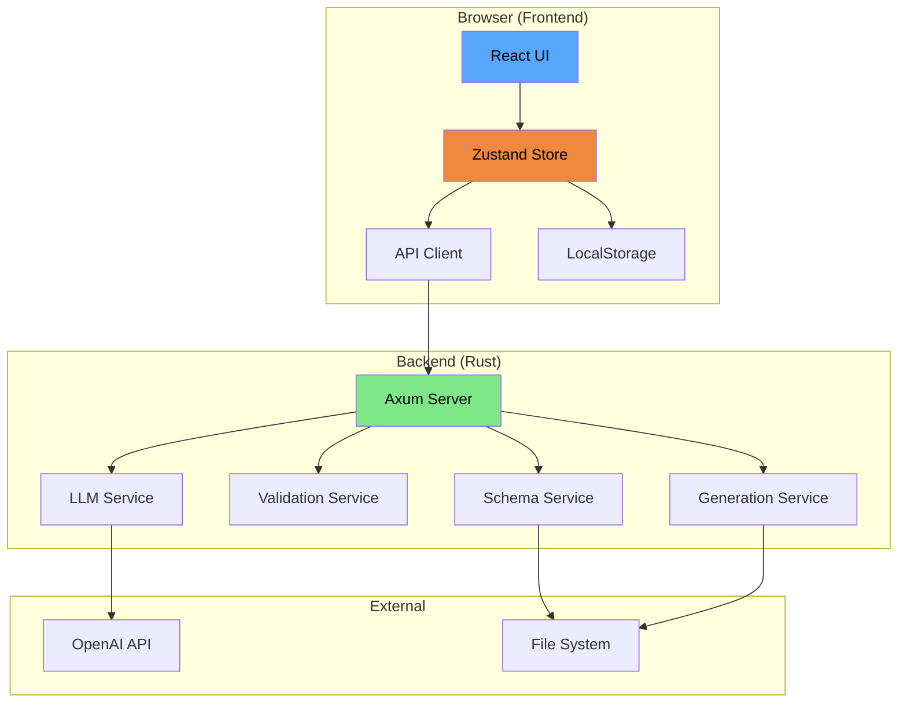
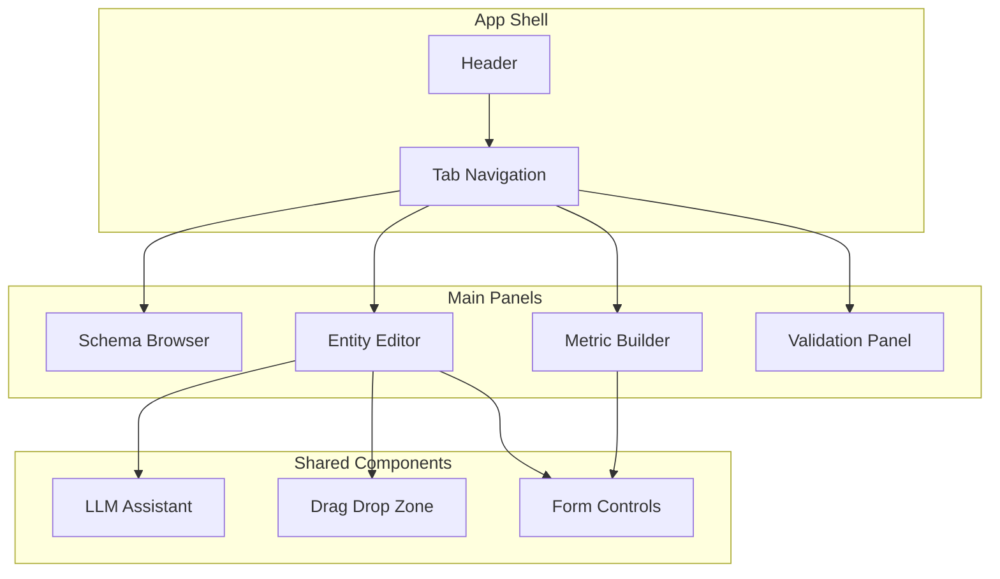

# Design Document: Semantic Model Editor

## Overview

The Semantic Model Editor is a browser-based GUI for creating and editing OCSF semantic models with LLM-assisted research capabilities. The system consists of a React/TypeScript frontend communicating with a Rust backend API server built on Axum.

The architecture follows a client-server model where:
- The frontend handles all UI interactions, local state management, and optimistic updates
- The backend provides schema data, validation, artifact generation, and LLM integration
- Communication occurs via JSON REST API with WebSocket support for real-time validation

## Architecture



### Technology Stack

**Frontend:**
- React 18 with TypeScript
- Zustand for state management (lightweight, minimal boilerplate)
- React DnD for drag-drop interactions
- Monaco Editor for SQL expression editing
- TanStack Query for API data fetching and caching

**Backend:**
- Axum web framework (async, tower-based)
- Existing ocsf-semantic, ocsf-core, ocsf-vector crates
- tokio async runtime
- serde_json for API serialization

## Components and Interfaces

### Frontend Components



#### SchemaTreeNode

Renders a single node in the OCSF schema tree with expand/collapse functionality.

```typescript
interface SchemaTreeNodeProps {
  node: SchemaNode;
  depth: number;
  isExpanded: boolean;
  isSelected: boolean;
  searchQuery: string;
  onToggle: (nodeId: string) => void;
  onSelect: (node: SchemaNode) => void;
}

interface SchemaNode {
  id: string;
  type: 'category' | 'class' | 'object' | 'attribute';
  name: string;
  caption: string;
  description?: string;
  children?: SchemaNode[];
  metadata?: AttributeMetadata;
}
```

#### EntityForm

Form component for creating/editing semantic entities.

```typescript
interface EntityFormProps {
  entity?: SemanticEntity;
  availableClasses: EventClass[];
  onSave: (entity: SemanticEntity) => void;
  onCancel: () => void;
}
```

#### AttributeMappingZone

Drag-drop zone for mapping OCSF attributes to semantic attributes.

```typescript
interface AttributeMappingZoneProps {
  entityAttributes: SemanticAttribute[];
  onDrop: (ocsfPath: string, position: number) => void;
  onRemove: (attributeName: string) => void;
  onEdit: (attribute: SemanticAttribute) => void;
}
```

#### LLMResearchPanel

Panel for LLM-assisted research with suggestion review.

```typescript
interface LLMResearchPanelProps {
  target: ResearchTarget;
  onAccept: (suggestion: LLMSuggestion) => void;
  onReject: (suggestionId: string) => void;
}

type ResearchTarget = 
  | { type: 'entity'; entity: SemanticEntity }
  | { type: 'attribute'; entity: SemanticEntity; attribute: SemanticAttribute };

interface LLMSuggestion {
  id: string;
  field: 'description' | 'synonyms' | 'security_context' | 'sample_values';
  value: string | string[];
  confidence: number;
}
```

### Backend API Endpoints

#### GET /api/schema

Returns the loaded OCSF schema in a tree-friendly format.

```typescript
// Response
interface SchemaResponse {
  version: string;
  categories: Category[];
  objects: OCSFObject[];
}
```

#### POST /api/validate

Validates a semantic model against the OCSF schema.

```typescript
// Request
interface ValidateRequest {
  model: SemanticModel;
}

// Response
interface ValidateResponse {
  valid: boolean;
  errors: ValidationError[];
  warnings: ValidationWarning[];
}

interface ValidationError {
  path: string;
  message: string;
  code: string;
}
```

#### POST /api/llm/research

Queries the LLM for semantic enrichments.

```typescript
// Request
interface ResearchRequest {
  target_type: 'entity' | 'attribute';
  entity_name: string;
  attribute_name?: string;
  ocsf_context: OCSFContext;
  requested_fields: ('description' | 'synonyms' | 'security_context')[];
}

// Response
interface ResearchResponse {
  suggestions: LLMSuggestion[];
  tokens_used: number;
}
```

#### POST /api/generate

Generates warehouse artifacts from a semantic model.

```typescript
// Request
interface GenerateRequest {
  model: SemanticModel;
  dialect: 'snowflake' | 'databricks' | 'bigquery';
  artifacts: ('dbt' | 'cubejs' | 'views' | 'etl')[];
}

// Response
interface GenerateResponse {
  files: GeneratedFile[];
}

interface GeneratedFile {
  path: string;
  content: string;
}
```

### Rust Backend Services

#### SchemaService

Loads and caches the OCSF schema, providing tree-structured access.

```rust
pub struct SchemaService {
    schema: Arc<CompiledSchema>,
    tree_cache: RwLock<Option<SchemaTree>>,
}

impl SchemaService {
    pub async fn load_schema(&self, path: &Path) -> Result<()>;
    pub fn get_tree(&self) -> SchemaTree;
    pub fn get_attribute(&self, class_uid: u32, path: &str) -> Option<&Attribute>;
    pub fn search(&self, query: &str) -> Vec<SearchResult>;
}
```

#### ValidationService

Validates semantic models against the loaded schema.

```rust
pub struct ValidationService {
    schema: Arc<SchemaService>,
}

impl ValidationService {
    pub fn validate(&self, model: &SemanticModel) -> ValidationReport;
    pub fn validate_field_path(&self, class_uid: u32, path: &str) -> Result<(), PathError>;
    pub fn validate_entity(&self, entity: &SemanticEntity) -> Vec<ValidationError>;
}
```

#### LLMService

Handles LLM API calls for semantic enrichment.

```rust
pub struct LLMService {
    client: reqwest::Client,
    api_key: String,
    model: String,
}

impl LLMService {
    pub async fn research_entity(&self, entity: &SemanticEntity, context: &OCSFContext) 
        -> Result<Vec<Suggestion>>;
    pub async fn research_attribute(&self, attr: &SemanticAttribute, context: &OCSFContext) 
        -> Result<Vec<Suggestion>>;
    pub async fn batch_research(&self, targets: Vec<ResearchTarget>) 
        -> Result<Vec<ResearchResult>>;
}
```

## Data Models

### Frontend State (Zustand Store)

```typescript
interface EditorState {
  // Model state
  model: SemanticModel;
  isDirty: boolean;
  
  // Schema state
  schema: SchemaTree | null;
  schemaLoading: boolean;
  
  // UI state
  selectedEntity: string | null;
  selectedMetric: string | null;
  expandedNodes: Set<string>;
  searchQuery: string;
  
  // Validation state
  validationErrors: ValidationError[];
  validationWarnings: ValidationWarning[];
  
  // Actions
  setModel: (model: SemanticModel) => void;
  addEntity: (entity: SemanticEntity) => void;
  updateEntity: (name: string, updates: Partial<SemanticEntity>) => void;
  removeEntity: (name: string) => void;
  addMetric: (metric: SemanticMetric) => void;
  updateMetric: (name: string, updates: Partial<SemanticMetric>) => void;
  removeMetric: (name: string) => void;
  setValidationResults: (errors: ValidationError[], warnings: ValidationWarning[]) => void;
}
```

### API Request/Response Types

```typescript
// Semantic Model (matches Rust SemanticModel)
interface SemanticModel {
  version: string;
  ocsf_version: string;
  name: string;
  description: string;
  entities: SemanticEntity[];
  metrics: SemanticMetric[];
  observable_config: ObservableConfig;
}

interface SemanticEntity {
  name: string;
  caption: string;
  description: string;
  source_event_classes: number[];
  attributes: SemanticAttribute[];
  relationships: EntityRelationship[];
  covers_observables: number[];
}

interface SemanticAttribute {
  name: string;
  caption: string;
  description: string;
  attr_type: SemanticType;
  ocsf_mapping: OCSFMapping;
  is_dimension: boolean;
  sample_values: string[];
  synonyms: string[];
  security_context?: string;
  value_pattern?: string;
  is_observable: boolean;
  threat_relevance?: ThreatRelevance;
}

interface SemanticMetric {
  name: string;
  caption: string;
  description: string;
  aggregation: 'count' | 'sum' | 'avg' | 'min' | 'max';
  measure: MeasureDefinition;
  dimensions: string[];
  time_granularities: TimeGranularity[];
}
```

### Schema Tree Structure

```typescript
interface SchemaTree {
  version: string;
  categories: CategoryNode[];
  objects: ObjectNode[];
}

interface CategoryNode {
  uid: number;
  name: string;
  caption: string;
  description: string;
  classes: ClassNode[];
}

interface ClassNode {
  uid: number;
  name: string;
  caption: string;
  description: string;
  attributes: AttributeNode[];
}

interface AttributeNode {
  name: string;
  caption: string;
  description: string;
  type: string;
  requirement: 'required' | 'recommended' | 'optional';
  is_array: boolean;
  enum_values?: EnumValue[];
  object_type?: string;
  children?: AttributeNode[];
}
```


## Correctness Properties

*A property is a characteristic or behavior that should hold true across all valid executions of a system—essentially, a formal statement about what the system should do. Properties serve as the bridge between human-readable specifications and machine-verifiable correctness guarantees.*

### Property 1: Schema Tree Expansion Consistency

*For any* category node in the schema tree, expanding it SHALL reveal exactly the event classes that belong to that category according to the loaded OCSF schema.

**Validates: Requirements 1.2**

### Property 2: Class Attribute Completeness

*For any* event class node in the schema tree, expanding it SHALL display all attributes defined for that class in the OCSF schema, with correct types and descriptions.

**Validates: Requirements 1.3**

### Property 3: Attribute Metadata Display

*For any* attribute in the schema tree, selecting it SHALL display metadata that matches the OCSF schema definition including type, requirement level, and enum values (if applicable).

**Validates: Requirements 1.4**

### Property 4: Search Result Accuracy

*For any* search query string, the filtered schema tree SHALL contain only nodes where the name or description contains the query string (case-insensitive).

**Validates: Requirements 1.5**

### Property 5: Drag-Drop Mapping Creation

*For any* OCSF attribute path dropped onto the entity editor, a semantic attribute SHALL be created with `ocsf_mapping.field` set to that exact path.

**Validates: Requirements 2.4**

### Property 6: Entity Modification State Sync

*For any* modification to an entity (add attribute, update field, remove attribute), the Zustand store state SHALL reflect the change before the next render cycle.

**Validates: Requirements 2.6**

### Property 7: Aggregation-Specific Options

*For any* aggregation type selected in the metric builder, the measure configuration options displayed SHALL be appropriate for that aggregation (e.g., field selector for count, expression editor for computed).

**Validates: Requirements 3.3**

### Property 8: Dimension Selection from Entity Attributes

*For any* entity with defined attributes, the metric builder dimension selector SHALL include all attributes from that entity that are marked as dimensions.

**Validates: Requirements 3.4**

### Property 9: LLM Research Context Inclusion

*For any* entity research request, the LLM API call SHALL include OCSF class metadata (name, description, category) for all source event classes.

**Validates: Requirements 4.2**

### Property 10: Observable Security Context Generation

*For any* attribute marked as `is_observable: true`, LLM research SHALL generate a security context suggestion explaining threat detection relevance.

**Validates: Requirements 4.4**

### Property 11: Suggestion Acceptance Application

*For any* accepted LLM suggestion, the target field (description, synonyms, security_context) on the corresponding entity or attribute SHALL be updated to the suggestion value.

**Validates: Requirements 4.6**

### Property 12: Batch Research Single Request

*For any* batch research operation with N targets, exactly one API request SHALL be made containing all N targets, rather than N separate requests.

**Validates: Requirements 4.7**

### Property 13: Field Path Validation Timing

*For any* field mapping modification, validation against the OCSF schema SHALL complete and return results within 500ms.

**Validates: Requirements 5.1**

### Property 14: Invalid Path Error Detection

*For any* field path that does not exist in the OCSF schema for the specified event class, validation SHALL return an error identifying the invalid path.

**Validates: Requirements 5.2**

### Property 15: Event Class Existence Validation

*For any* entity with source_event_classes, validation SHALL verify each class UID exists in the loaded OCSF schema and report errors for non-existent classes.

**Validates: Requirements 5.3**

### Property 16: Dimension Reference Validation

*For any* metric with dimensions, validation SHALL verify each dimension name exists as an attribute in the referenced entity and report errors for missing dimensions.

**Validates: Requirements 5.4**

### Property 17: YAML Import Structure Validation

*For any* YAML string imported, the editor SHALL validate it conforms to the SemanticModel schema structure before loading into state.

**Validates: Requirements 6.3**

### Property 18: Auto-Save State Restoration

*For any* model state saved to localStorage, loading the editor SHALL restore that exact model state (entities, metrics, observable_config).

**Validates: Requirements 6.6**

### Property 19: Validation API Response Format

*For any* semantic model submitted to POST /api/validate, the response SHALL contain a `valid` boolean and arrays of `errors` and `warnings` with path and message fields.

**Validates: Requirements 7.2**

### Property 20: Generation API Artifact Output

*For any* valid semantic model submitted to POST /api/generate with specified dialect and artifacts, the response SHALL contain generated files for each requested artifact type.

**Validates: Requirements 7.3**

### Property 21: API Error Response Format

*For any* API request that results in an error, the response SHALL include an appropriate HTTP status code (4xx for client errors, 5xx for server errors) and a JSON body with error details.

**Validates: Requirements 7.5**

### Property 22: Keyboard Shortcut Action Mapping

*For any* registered keyboard shortcut (Ctrl+S, Ctrl+Z, Ctrl+Y), pressing it SHALL trigger the corresponding action (save, undo, redo) on the current model state.

**Validates: Requirements 8.4**

## Error Handling

### Frontend Error Handling

```typescript
// API error handling with typed errors
interface APIError {
  status: number;
  code: string;
  message: string;
  details?: Record<string, unknown>;
}

// Error boundary for component failures
class EditorErrorBoundary extends React.Component {
  state = { hasError: false, error: null };
  
  static getDerivedStateFromError(error: Error) {
    return { hasError: true, error };
  }
  
  render() {
    if (this.state.hasError) {
      return <ErrorFallback error={this.state.error} onRetry={this.reset} />;
    }
    return this.props.children;
  }
}

// Validation error display
interface ValidationErrorDisplay {
  path: string;      // e.g., "entities[0].attributes[2].ocsf_mapping.field"
  message: string;   // Human-readable error
  severity: 'error' | 'warning';
  onClick: () => void; // Navigate to error location
}
```

### Backend Error Handling

```rust
use thiserror::Error;

#[derive(Error, Debug)]
pub enum EditorApiError {
    #[error("Schema not loaded")]
    SchemaNotLoaded,
    
    #[error("Invalid field path: {path} in class {class_uid}")]
    InvalidFieldPath { path: String, class_uid: u32 },
    
    #[error("Entity not found: {name}")]
    EntityNotFound { name: String },
    
    #[error("Validation failed: {0}")]
    ValidationFailed(String),
    
    #[error("LLM request failed: {0}")]
    LLMError(String),
    
    #[error("YAML parse error at line {line}: {message}")]
    YamlParseError { line: usize, message: String },
    
    #[error("Internal error: {0}")]
    Internal(#[from] anyhow::Error),
}

impl EditorApiError {
    pub fn status_code(&self) -> StatusCode {
        match self {
            Self::SchemaNotLoaded => StatusCode::SERVICE_UNAVAILABLE,
            Self::InvalidFieldPath { .. } => StatusCode::BAD_REQUEST,
            Self::EntityNotFound { .. } => StatusCode::NOT_FOUND,
            Self::ValidationFailed(_) => StatusCode::UNPROCESSABLE_ENTITY,
            Self::LLMError(_) => StatusCode::BAD_GATEWAY,
            Self::YamlParseError { .. } => StatusCode::BAD_REQUEST,
            Self::Internal(_) => StatusCode::INTERNAL_SERVER_ERROR,
        }
    }
}

// Axum error response
impl IntoResponse for EditorApiError {
    fn into_response(self) -> Response {
        let status = self.status_code();
        let body = Json(json!({
            "error": {
                "code": format!("{:?}", self),
                "message": self.to_string(),
            }
        }));
        (status, body).into_response()
    }
}
```

### Error Recovery Strategies

| Error Type | Recovery Strategy |
|------------|-------------------|
| Network failure | Retry with exponential backoff, show offline indicator |
| Schema load failure | Show error with reload button, disable editing |
| Validation timeout | Show partial results, allow manual re-validation |
| LLM API failure | Show error with retry button, allow manual entry |
| LocalStorage full | Warn user, offer export to file |
| Invalid YAML import | Show line-by-line errors, don't modify current state |

## Testing Strategy

### Dual Testing Approach

The editor requires both unit tests and property-based tests for comprehensive coverage:

- **Unit tests**: Verify specific UI interactions, API response handling, and edge cases
- **Property tests**: Verify universal properties across all valid inputs using `proptest`

### Frontend Testing

**Unit Tests (Vitest + React Testing Library)**:
- Component rendering tests
- User interaction tests (click, drag-drop, keyboard)
- API mock response handling
- Error boundary behavior

**Property Tests (fast-check)**:
- Schema tree filtering with arbitrary search strings
- State management consistency across random operations
- YAML serialization round-trip

```typescript
// Example property test with fast-check
import * as fc from 'fast-check';

// Property: Search results only contain matching nodes
test('search filters correctly', () => {
  fc.assert(
    fc.property(
      fc.string({ minLength: 1, maxLength: 50 }),
      schemaTreeArbitrary,
      (query, tree) => {
        const filtered = filterSchemaTree(tree, query);
        return allNodesMatch(filtered, query);
      }
    ),
    { numRuns: 100 }
  );
});
```

### Backend Testing

**Unit Tests (Rust #[test])**:
- API endpoint response formats
- Validation logic for specific cases
- Error type conversions

**Property Tests (proptest)**:
- Validation detects all invalid paths
- Serialization round-trip for all model types
- API error responses have correct status codes

```rust
// Example property test with proptest
use proptest::prelude::*;

proptest! {
    #![proptest_config(ProptestConfig::with_cases(100))]
    
    // Feature: semantic-model-editor, Property 14: Invalid Path Error Detection
    #[test]
    fn invalid_paths_detected(
        class_uid in 1000u32..10000,
        invalid_path in "[a-z]+\\.[a-z]+\\.[a-z]+"
    ) {
        let schema = load_test_schema();
        let result = validate_field_path(&schema, class_uid, &invalid_path);
        
        // If path doesn't exist in schema, validation must return error
        if !schema.path_exists(class_uid, &invalid_path) {
            prop_assert!(result.is_err());
        }
    }
    
    // Feature: semantic-model-editor, Property 18: Auto-Save State Restoration
    #[test]
    fn model_serialization_roundtrip(model in semantic_model_strategy()) {
        let yaml = model.to_yaml().unwrap();
        let restored = SemanticModel::from_yaml(&yaml).unwrap();
        prop_assert_eq!(model, restored);
    }
}
```

### Test Configuration

- Property tests: Minimum 100 iterations per property
- Each property test tagged with: `Feature: semantic-model-editor, Property N: {property_text}`
- Frontend tests run with `vitest --run`
- Backend tests run with `cargo test --workspace`

### Integration Testing

- API endpoint tests with test server
- End-to-end validation flow tests
- LLM service mock tests (no real API calls in CI)
