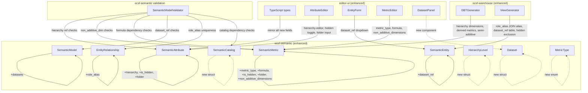

# Design: SML Semantic Enhancements

## Overview

This design extends the `ocsf-semantic` crate and its downstream consumers (`ocsf-warehouse`, `editor-ui`) to support SML v1.4 patterns: dimension hierarchies, semi-additive/calculated metrics, dataset abstraction, role-playing relationships, visibility/folder metadata, and a catalog manifest. All changes are additive — new optional fields with serde defaults — preserving backward compatibility with existing YAML models.

The design follows the existing layered architecture (Core → Semantic → Warehouse → Editor) and builder pattern conventions already established in the codebase.

## Architecture



### Change Impact by Crate

| Crate | Files Modified | Files Added |
|-------|---------------|-------------|
| `ocsf-semantic` | `entity.rs`, `metric.rs`, `model.rs`, `validation.rs`, `schema_generator.rs`, `lib.rs` | `catalog.rs` |
| `ocsf-warehouse` | `dbt.rs`, `views.rs` | — |
| `editor-ui` | `types/index.ts`, `AttributeEditor.tsx`, `EntityForm.tsx`, `store/editorStore.ts` | `MetricEditor.tsx`, `DatasetPanel.tsx` |

## Components and Interfaces

### 1. New Rust Structs and Enums (`ocsf-semantic`)

#### HierarchyLevel (entity.rs)

```rust
/// A single level in a dimension drill-down hierarchy.
#[derive(Debug, Clone, PartialEq, Serialize, Deserialize)]
pub struct HierarchyLevel {
    /// Display name for this hierarchy level (e.g., "Country", "Region").
    pub name: String,
    /// Reference to an attribute name within the same entity.
    pub attribute_ref: String,
}
```

#### MetricType (metric.rs)

```rust
/// Classification of metric additivity behavior.
#[derive(Debug, Clone, Copy, PartialEq, Eq, Serialize, Deserialize)]
pub enum MetricType {
    Additive,
    SemiAdditive,
    NonAdditive,
}

impl Default for MetricType {
    fn default() -> Self {
        MetricType::Additive
    }
}
```

#### Dataset (model.rs)

```rust
/// A physical data source abstraction decoupled from semantic definitions.
#[derive(Debug, Clone, PartialEq, Serialize, Deserialize)]
pub struct Dataset {
    pub name: String,
    pub dialect: String,
    pub table: String,
    #[serde(default, skip_serializing_if = "Option::is_none")]
    pub schema_name: Option<String>,
    #[serde(default, skip_serializing_if = "Option::is_none")]
    pub connection: Option<String>,
}
```

#### SemanticCatalog and CatalogEntry (catalog.rs — new file)

```rust
/// A catalog manifest tracking multiple semantic models.
#[derive(Debug, Clone, PartialEq, Serialize, Deserialize)]
pub struct SemanticCatalog {
    pub name: String,
    pub version: String,
    #[serde(default, skip_serializing_if = "Option::is_none")]
    pub description: Option<String>,
    #[serde(default)]
    pub models: Vec<CatalogEntry>,
}

/// An entry in the semantic catalog referencing a single model.
#[derive(Debug, Clone, PartialEq, Serialize, Deserialize)]
pub struct CatalogEntry {
    pub model_name: String,
    pub path: String,
    pub version: String,
    #[serde(default, skip_serializing_if = "Vec::is_empty")]
    pub dependencies: Vec<String>,
}

impl SemanticCatalog {
    pub fn to_yaml(&self) -> Result<String> { ... }
    pub fn from_yaml(yaml: &str) -> Result<Self> { ... }
}
```

### 2. Modified Rust Structs

#### SemanticAttribute — new fields

```rust
pub struct SemanticAttribute {
    // ... existing fields ...

    /// Ordered drill-down hierarchy levels for this dimension.
    #[serde(default, skip_serializing_if = "Vec::is_empty")]
    pub hierarchy: Vec<HierarchyLevel>,

    /// Whether this attribute is hidden from downstream UI/views.
    #[serde(default, skip_serializing_if = "crate::is_false")]
    pub is_hidden: bool,

    /// Logical folder for UI grouping.
    #[serde(default, skip_serializing_if = "Option::is_none")]
    pub folder: Option<String>,
}
```

When `hierarchy` is non-empty, the attribute is implicitly a dimension regardless of `is_dimension`.

#### SemanticMetric — new fields

```rust
pub struct SemanticMetric {
    // ... existing fields ...

    /// Additivity classification.
    #[serde(default)]
    pub metric_type: MetricType,

    /// Formula expression for calculated metrics (references other metric names).
    #[serde(default, skip_serializing_if = "Option::is_none")]
    pub formula: Option<String>,

    /// Dimensions across which a semi-additive metric cannot be summed.
    #[serde(default, skip_serializing_if = "Vec::is_empty")]
    pub non_additive_dimensions: Vec<String>,

    /// Whether this metric is hidden from downstream UI/views.
    #[serde(default, skip_serializing_if = "crate::is_false")]
    pub is_hidden: bool,

    /// Logical folder for UI grouping.
    #[serde(default, skip_serializing_if = "Option::is_none")]
    pub folder: Option<String>,
}
```

When `formula` is `Some(...)`, the metric is a calculated metric and `measure` is ignored.

#### SemanticModel — new field

```rust
pub struct SemanticModel {
    // ... existing fields ...

    /// Physical data source definitions.
    #[serde(default, skip_serializing_if = "Vec::is_empty")]
    pub datasets: Vec<Dataset>,
}
```

#### SemanticEntity — new field

```rust
pub struct SemanticEntity {
    // ... existing fields ...

    /// Reference to a Dataset by name for physical source resolution.
    #[serde(default, skip_serializing_if = "Option::is_none")]
    pub dataset_ref: Option<String>,
}
```

#### EntityRelationship — new field

```rust
pub struct EntityRelationship {
    // ... existing fields ...

    /// Role alias for role-playing relationships (used as SQL table alias).
    #[serde(default, skip_serializing_if = "Option::is_none")]
    pub role_alias: Option<String>,
}
```

The `to_join_sql` method changes to use `role_alias` as the table alias when present:

```rust
pub fn to_join_sql(&self, from_entity: &str) -> String {
    match &self.role_alias {
        Some(alias) => format!(
            "JOIN {} AS {} ON {}",
            self.target_entity,
            alias,
            self.join_condition.replace("{from}", from_entity)
        ),
        None => format!(
            "JOIN {} ON {}",
            self.target_entity,
            self.join_condition.replace("{from}", from_entity)
        ),
    }
}
```

### 3. Validation Enhancements (`validation.rs`)

New `ValidationError` variants:

```rust
pub enum ValidationError {
    // ... existing variants ...

    #[error("Hierarchy attribute_ref '{attribute_ref}' not found in entity '{entity}'")]
    InvalidHierarchyRef { entity: String, attribute_ref: String },

    #[error("Duplicate attribute_ref '{attribute_ref}' in hierarchy of entity '{entity}'")]
    DuplicateHierarchyRef { entity: String, attribute_ref: String },

    #[error("Non-additive dimension '{dimension}' on metric '{metric}' does not reference a valid dimension")]
    InvalidNonAdditiveDimension { metric: String, dimension: String },

    #[error("Formula in metric '{metric}' references unknown metric '{referenced}'")]
    InvalidFormulaRef { metric: String, referenced: String },

    #[error("Circular dependency detected in calculated metric '{metric}'")]
    CircularMetricDependency { metric: String },

    #[error("Dataset ref '{dataset_ref}' on entity '{entity}' not found in model datasets")]
    InvalidDatasetRef { entity: String, dataset_ref: String },

    #[error("Duplicate role alias required: entity '{entity}' has multiple relationships to '{target}' without distinct role_alias")]
    MissingRoleAlias { entity: String, target: String },

    #[error("Duplicate model name '{name}' in catalog")]
    DuplicateCatalogModelName { name: String },

    #[error("Catalog dependency '{dependency}' for model '{model}' not found")]
    InvalidCatalogDependency { model: String, dependency: String },
}
```

New validation methods on `SemanticModelValidator`:

| Method | Validates |
|--------|-----------|
| `validate_hierarchies(&self, entity, result)` | Req 1.4, 1.5 — hierarchy attribute_ref resolution and uniqueness |
| `validate_metric_type(&self, metric, model, result)` | Req 2.4, 2.5 — non_additive_dimensions reference valid dimensions |
| `validate_formula(&self, metric, model, result)` | Req 3.3, 3.4 — formula references exist, no circular dependencies |
| `validate_dataset_refs(&self, model, result)` | Req 4.4 — dataset_ref resolves to a model dataset |
| `validate_role_aliases(&self, entity, result)` | Req 5.2 — duplicate target entities require distinct role_alias |
| `validate_catalog(catalog) -> ValidationResult` | Req 7.3, 7.4 — catalog dependency and uniqueness checks (standalone fn) |

Formula reference extraction uses the existing `extract_field_references` pattern but adapted for metric names:

```rust
/// Extracts metric name references from a formula string.
/// Metric names are identifiers not preceded by a dot (to distinguish from field paths).
pub fn extract_metric_references(formula: &str) -> Vec<String> { ... }
```

Circular dependency detection uses a DFS traversal over the metric dependency graph.

### 4. Schema Generator Enhancements (`schema_generator.rs`)

Changes to `SchemaGenerator`:
- `convert_attribute`: sets `is_hidden: false`, `folder: None` (preserving defaults per Req 9.4)
- `generate_object_entity` / `generate_class_entity`: infers hierarchies from OCSF object nesting (Req 9.3) — when an object has fields like `country`, `region`, `city`, generates a `HierarchyLevel` chain
- Generated metrics get `metric_type` based on aggregation: `Count`/`Sum` → `Additive`, `Avg`/`Min`/`Max` → `NonAdditive` (Req 9.1)
- No `Dataset` generation (Req 9.5)

Changes to `MetricSuggester`:
- When a class has a status field, generates a calculated metric for success rate: `formula: Some("success_count / total_count".into())` (Req 9.2)

### 5. Warehouse Generator Enhancements

#### DBTGenerator (`dbt.rs`)

| Change | Requirement |
|--------|-------------|
| Emit hierarchy levels as nested `dimensions` with `type: hierarchy` | Req 10.1 |
| Set `agg_time_dimension` on semi-additive measures from `non_additive_dimensions` | Req 10.2 |
| Emit calculated metrics as `derived` metric type with `formula` expression | Req 10.3 |

#### ViewGenerator (`views.rs`)

| Change | Requirement |
|--------|-------------|
| Use `role_alias` as SQL table alias in JOIN clauses | Req 10.4 |
| Resolve source table from `dataset_ref` → `Dataset.table`, fallback to OCSF naming | Req 10.5 |
| Exclude `is_hidden` attributes/metrics from generated SQL views | Req 10.6 |

The `get_source_table` method changes:

```rust
fn get_source_table(&self, entity: &SemanticEntity, model: &SemanticModel) -> String {
    if let Some(ref dataset_ref) = entity.dataset_ref {
        if let Some(dataset) = model.datasets.iter().find(|d| d.name == *dataset_ref) {
            return match &dataset.schema_name {
                Some(schema) => format!("{}.{}", schema, dataset.table),
                None => dataset.table.clone(),
            };
        }
    }
    // Fallback to existing OCSF table naming
    self.qualify_name(&format!("ocsf_{}", entity.name))
}
```

### 6. Editor GUI Enhancements (`editor-ui`)

#### TypeScript Type Updates (`types/index.ts`)

```typescript
// New types
interface HierarchyLevel {
  name: string;
  attribute_ref: string;
}

type MetricType = 'Additive' | 'SemiAdditive' | 'NonAdditive';

interface Dataset {
  name: string;
  dialect: string;
  table: string;
  schema_name?: string;
  connection?: string;
}

// Updated interfaces (new optional fields)
interface SemanticAttribute {
  // ... existing fields ...
  hierarchy?: HierarchyLevel[];
  is_hidden?: boolean;
  folder?: string;
}

interface SemanticMetric {
  // ... existing fields ...
  metric_type?: MetricType;
  formula?: string;
  non_additive_dimensions?: string[];
  is_hidden?: boolean;
  folder?: string;
}

interface SemanticModel {
  // ... existing fields ...
  datasets?: Dataset[];
}

interface SemanticEntity {
  // ... existing fields ...
  dataset_ref?: string;
}

interface EntityRelationship {
  // ... existing fields ...
  role_alias?: string;
}
```

#### Component Changes

| Component | Changes |
|-----------|---------|
| `AttributeEditor.tsx` | Add `is_hidden` toggle, `folder` text input, hierarchy level editor (ordered list with add/remove/reorder) |
| `EntityForm.tsx` | Add `dataset_ref` dropdown populated from `model.datasets` |
| `MetricEditor.tsx` (new) | `metric_type` select, `formula` textarea (shown when calculated), `non_additive_dimensions` multi-select (shown when SemiAdditive), `is_hidden` toggle, `folder` input |
| `DatasetPanel.tsx` (new) | CRUD panel for `Dataset` entries on the model |
| Relationship editor section | Add `role_alias` text input |
| List views | Dim hidden items with CSS class, group by `folder` when set |

#### Store Updates (`editorStore.ts`)

New actions:
- `addDataset(dataset: Dataset)`
- `updateDataset(name: string, dataset: Dataset)`
- `removeDataset(name: string)`
- `updateEntityDatasetRef(entityName: string, datasetRef: string | undefined)`

New selectors:
- `selectDatasets(state): Dataset[]`
- `selectVisibleAttributes(state, entityName): SemanticAttribute[]`
- `selectAttributesByFolder(state, entityName): Record<string, SemanticAttribute[]>`

## Data Models

### YAML Serialization Format

All new fields use `#[serde(default)]` and `#[serde(skip_serializing_if = ...)]` to ensure backward compatibility. Existing YAML files without the new fields deserialize with defaults (empty vecs, `None`, `false`, `MetricType::Additive`).

Example YAML with all new features:

```yaml
name: security_analytics
version: "2.0"
ocsf_version: "1.3.0"
description: Enhanced security analytics model

datasets:
  - name: prod_warehouse
    dialect: snowflake
    table: ocsf_events
    schema_name: security
    connection: snowflake://prod

entities:
  - name: network_activity
    caption: Network Activity
    dataset_ref: prod_warehouse
    source_event_classes: [4001]
    attributes:
      - name: src_country
        caption: Source Country
        is_dimension: true
        hierarchy:
          - name: Country
            attribute_ref: src_country
          - name: Region
            attribute_ref: src_region
          - name: City
            attribute_ref: src_city
        ocsf_mapping:
          field: src_endpoint.location.country
      - name: src_region
        caption: Source Region
        is_dimension: true
        is_hidden: true
        folder: Geography
        ocsf_mapping:
          field: src_endpoint.location.region
      - name: src_city
        caption: Source City
        is_dimension: true
        is_hidden: true
        folder: Geography
        ocsf_mapping:
          field: src_endpoint.location.city
    relationships:
      - name: source_user
        target_entity: user
        role_alias: src_user
        join_condition: "{from}.user_uid = user.uid"
      - name: target_user
        target_entity: user
        role_alias: tgt_user
        join_condition: "{from}.target_user_uid = user.uid"

metrics:
  - name: active_sessions
    caption: Active Sessions
    metric_type: SemiAdditive
    non_additive_dimensions: [time]
    aggregation: Sum
    measure:
      field: session_count
    dimensions: [src_country, device_type]
    folder: Session Metrics
  - name: alert_to_incident_ratio
    caption: Alert to Incident Ratio
    metric_type: NonAdditive
    formula: "alert_count / incident_count"
    dimensions: [severity, category]
```

### Serde Helper

A small helper for `skip_serializing_if` on `bool` fields:

```rust
fn is_false(v: &bool) -> bool { !v }
```

This already exists in the codebase pattern via `#[serde(default, skip_serializing_if = "crate::is_false")]` or can be added to `lib.rs`.

### Backward Compatibility Guarantees

- All new fields have `#[serde(default)]` — old YAML files load without error
- All new fields have `skip_serializing_if` — models without new features produce identical YAML
- `MetricType` defaults to `Additive` — existing metrics behave identically
- `dataset_ref: None` falls back to existing OCSF table naming in view generation
- `role_alias: None` produces the same JOIN SQL as before
- `is_hidden: false` (default) means no attributes/metrics are excluded from views


## Correctness Properties

*A property is a characteristic or behavior that should hold true across all valid executions of a system — essentially, a formal statement about what the system should do. Properties serve as the bridge between human-readable specifications and machine-verifiable correctness guarantees.*

### Property 1: SemanticEntity YAML round-trip

*For any* valid `SemanticEntity` with arbitrary combinations of hierarchy levels, role-playing relationships, `is_hidden` flags, and `folder` values on its attributes, serializing to YAML then deserializing shall produce an equivalent `SemanticEntity` with all fields preserved including hierarchy level order.

**Validates: Requirements 1.7, 5.5, 6.7**

### Property 2: SemanticMetric YAML round-trip

*For any* valid `SemanticMetric` with an arbitrary `metric_type`, optional `formula`, `non_additive_dimensions`, `is_hidden`, and `folder`, serializing to YAML then deserializing shall produce an equivalent `SemanticMetric`.

**Validates: Requirements 2.7, 3.7**

### Property 3: SemanticModel YAML round-trip (with datasets)

*For any* valid `SemanticModel` containing a list of `Dataset` entries and entities with `dataset_ref` values, serializing to YAML then deserializing shall produce an equivalent `SemanticModel`.

**Validates: Requirements 4.7**

### Property 4: SemanticCatalog YAML round-trip

*For any* valid `SemanticCatalog` with entries and dependencies, serializing to YAML then deserializing shall produce an equivalent `SemanticCatalog`.

**Validates: Requirements 7.6**

### Property 5: Hierarchy implies dimension

*For any* `SemanticEntity` and any `SemanticAttribute` within it that has a non-empty `hierarchy` field, that attribute shall appear in the entity's `dimensions()` iterator regardless of the value of `is_dimension`.

**Validates: Requirements 1.2**

### Property 6: Hierarchy attribute_ref validation

*For any* `SemanticEntity` where a hierarchy level's `attribute_ref` does not match any attribute name in the same entity, the `SemanticModelValidator` shall report a validation error.

**Validates: Requirements 1.4**

### Property 7: Non-additive dimension validation

*For any* `SemanticModel` where a semi-additive metric's `non_additive_dimensions` contains a name that does not match any dimension attribute in any entity, the `SemanticModelValidator` shall report a validation error.

**Validates: Requirements 2.4**

### Property 8: Formula reference validation

*For any* `SemanticModel` where a calculated metric's `formula` references a metric name that does not exist in the model, the `SemanticModelValidator` shall report a validation error.

**Validates: Requirements 3.3**

### Property 9: Circular formula dependency detection

*For any* `SemanticModel` containing a cycle in the calculated metric dependency graph (metric A references metric B which references metric A, directly or transitively), the `SemanticModelValidator` shall report a circular dependency error.

**Validates: Requirements 3.4**

### Property 10: Formula metric name extraction

*For any* set of valid metric names embedded in a formula string with arithmetic operators, the `extract_metric_references` function shall return exactly those metric names.

**Validates: Requirements 3.5**

### Property 11: Dataset ref validation

*For any* `SemanticModel` where an entity's `dataset_ref` does not match any `Dataset.name` in the model's `datasets` list, the `SemanticModelValidator` shall report a validation error.

**Validates: Requirements 4.4**

### Property 12: Dataset ref table resolution in views

*For any* `SemanticEntity` with a `dataset_ref` pointing to a valid `Dataset`, the `ViewGenerator` shall use the `Dataset.table` (qualified by `schema_name` if present) as the source table in the generated SQL. For any entity without a `dataset_ref`, the generator shall fall back to the OCSF table naming convention.

**Validates: Requirements 4.5, 10.5**

### Property 13: Role alias uniqueness validation

*For any* `SemanticEntity` with two or more `EntityRelationship` values targeting the same entity without distinct `role_alias` values, the `SemanticModelValidator` shall report a validation error.

**Validates: Requirements 5.2**

### Property 14: Role alias in JOIN SQL

*For any* `EntityRelationship` with a `role_alias` set, the `to_join_sql` method shall produce a SQL string containing `AS {role_alias}`. For any relationship without a `role_alias`, the output shall not contain an `AS` clause.

**Validates: Requirements 5.3, 10.4**

### Property 15: Default visibility omission in YAML

*For any* `SemanticAttribute` or `SemanticMetric` where `is_hidden` is `false` and `folder` is `None`, the serialized YAML string shall not contain the substrings `is_hidden` or `folder`.

**Validates: Requirements 6.5**

### Property 16: Catalog dependency validation

*For any* `SemanticCatalog` where a `CatalogEntry` lists a dependency model name that does not exist as another entry in the catalog, the validator shall report an error.

**Validates: Requirements 7.3**

### Property 17: Catalog duplicate model name detection

*For any* `SemanticCatalog` containing two or more `CatalogEntry` values with the same `model_name`, the validator shall report a duplicate model name error.

**Validates: Requirements 7.4**

### Property 18: Generated metric type matches aggregation

*For any* OCSF class processed by `SchemaGenerator`, all generated metrics with `Count` or `Sum` aggregation shall have `metric_type` set to `Additive`, and all generated metrics with `Avg`, `Min`, or `Max` aggregation shall have `metric_type` set to `NonAdditive`.

**Validates: Requirements 9.1**

### Property 19: Generator default visibility and no datasets

*For any* model produced by `SchemaGenerator`, all generated attributes shall have `is_hidden == false` and `folder == None`, all generated metrics shall have `is_hidden == false` and `folder == None`, and the model's `datasets` list shall be empty.

**Validates: Requirements 9.4, 9.5**

### Property 20: Hidden attributes excluded from generated views

*For any* `SemanticEntity` containing attributes where `is_hidden` is `true`, the SQL view generated by `ViewGenerator` shall not include those attribute names in the SELECT column list.

**Validates: Requirements 10.6**

### Property 21: DBT hierarchy dimension emission

*For any* `SemanticEntity` with attributes that have non-empty `hierarchy` fields, the `DBTGenerator` output shall contain dimension entries with `type: hierarchy` for those attributes.

**Validates: Requirements 10.1**

### Property 22: DBT semi-additive measure constraints

*For any* `SemanticMetric` with `metric_type` set to `SemiAdditive`, the `DBTGenerator` output shall include `agg_time_dimension` constraints derived from `non_additive_dimensions`.

**Validates: Requirements 10.2**

### Property 23: DBT derived metric emission

*For any* `SemanticMetric` with a non-empty `formula`, the `DBTGenerator` output shall emit it as a `derived` metric type containing the formula expression.

**Validates: Requirements 10.3**

## Error Handling

### Validation Errors

All new validation rules produce typed `ValidationError` variants (not string messages) to enable programmatic handling. The validator collects all errors in a single pass — it does not short-circuit on the first error.

| Error Scenario | Error Variant | Severity |
|---------------|---------------|----------|
| Hierarchy `attribute_ref` not found | `InvalidHierarchyRef` | Error |
| Duplicate `attribute_ref` in hierarchy | `DuplicateHierarchyRef` | Error |
| Non-additive dimension not a valid dimension | `InvalidNonAdditiveDimension` | Error |
| Semi-additive with empty `non_additive_dimensions` | Warning (string) | Warning |
| Formula references unknown metric | `InvalidFormulaRef` | Error |
| Circular metric dependency | `CircularMetricDependency` | Error |
| `dataset_ref` not found in datasets | `InvalidDatasetRef` | Error |
| Duplicate target without distinct `role_alias` | `MissingRoleAlias` | Error |
| Duplicate `model_name` in catalog | `DuplicateCatalogModelName` | Error |
| Catalog dependency not found | `InvalidCatalogDependency` | Error |

### Deserialization Errors

All new fields use `#[serde(default)]`, so missing fields never cause deserialization errors. Invalid enum values (e.g., `metric_type: "Invalid"`) produce standard serde deserialization errors with the field name and expected values.

### Generator Error Handling

The `SchemaGenerator` and `MetricSuggester` use `Result<T, GenerationError>` for fallible operations. Hierarchy inference is best-effort — if field name patterns don't match known geographic/organizational patterns, no hierarchy is generated (no error).

## Testing Strategy

### Property-Based Testing

Use `proptest` (already a dependency) with minimum 100 iterations per property. Each test references its design property number.

Tag format: `Feature: sml-semantic-enhancements, Property {N}: {title}`

Property tests go in existing proptest modules:
- `ocsf-semantic/src/entity_proptest.rs` — Properties 1, 5, 6, 13, 14, 15
- `ocsf-semantic/src/metric_proptest.rs` — Properties 2, 10
- `ocsf-semantic/src/validation_proptest.rs` — Properties 7, 8, 9, 11
- New `ocsf-semantic/src/catalog_proptest.rs` — Properties 4, 16, 17
- New `ocsf-semantic/src/model_proptest.rs` — Property 3
- New `ocsf-warehouse/src/dbt_proptest.rs` — Properties 21, 22, 23
- New `ocsf-warehouse/src/views_proptest.rs` — Properties 12, 20

Generators needed:
- `arb_hierarchy_level()` — generates valid `HierarchyLevel` with random name and attribute_ref
- `arb_metric_type()` — generates random `MetricType` variant
- `arb_dataset()` — generates valid `Dataset` with random fields
- `arb_catalog_entry()` — generates valid `CatalogEntry`
- `arb_semantic_catalog()` — generates valid `SemanticCatalog` with consistent dependencies
- Extend existing `arb_semantic_attribute()` with new optional fields
- Extend existing `arb_semantic_metric()` with new optional fields
- Extend existing `arb_semantic_entity()` with new optional fields

### Unit Testing

Unit tests complement property tests for specific examples and edge cases:

- Deserialization of YAML without `metric_type` defaults to `Additive` (Req 2.2)
- Hierarchy inference from OCSF objects with country/region/city fields (Req 9.3)
- `MetricSuggester` generates calculated success rate metric for classes with status field (Req 9.2)
- Semi-additive metric with empty `non_additive_dimensions` produces warning (Req 2.5)
- Duplicate `attribute_ref` in hierarchy produces error (Req 1.5)
- Backward compatibility: existing YAML without new fields loads correctly

### Integration Testing

- End-to-end: load a YAML model with all new features → validate → generate dbt/views → verify output correctness
- Editor API: POST a model with new fields → GET it back → verify round-trip through the Rust backend
